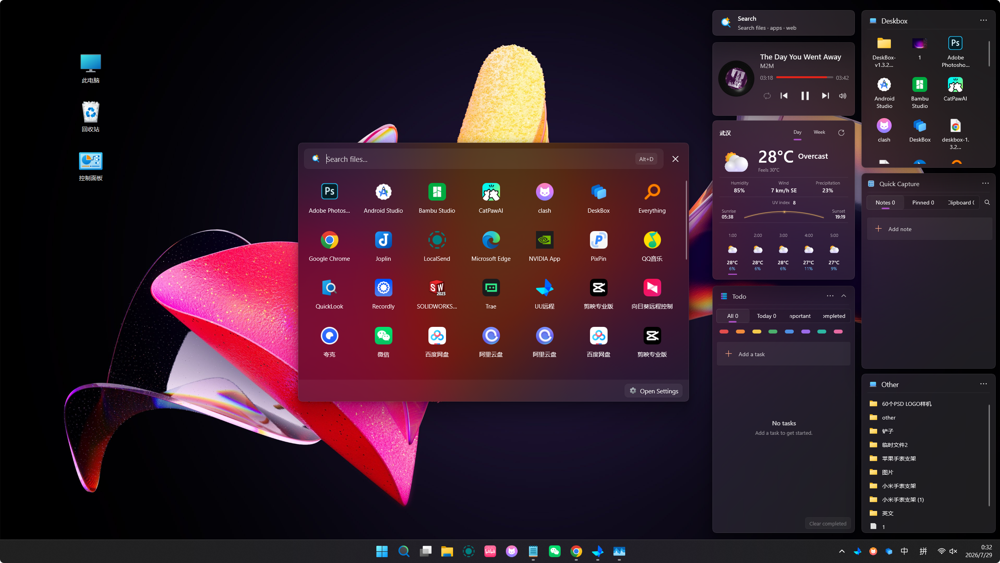
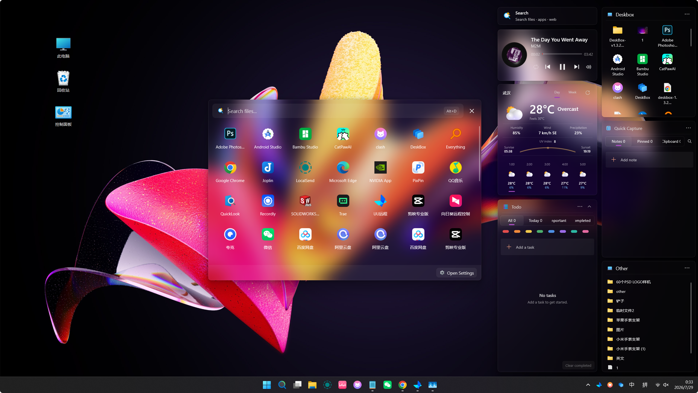
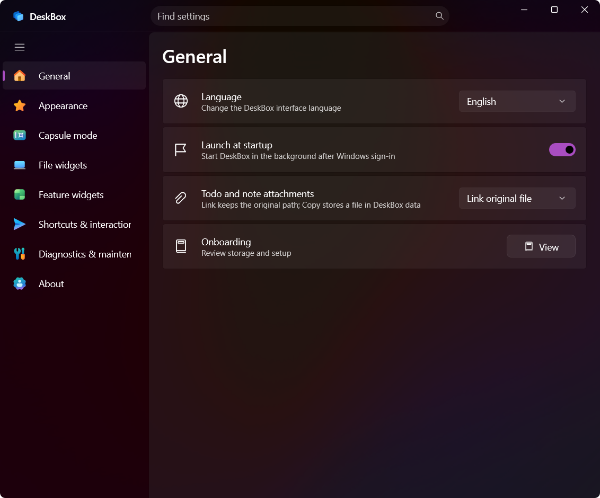
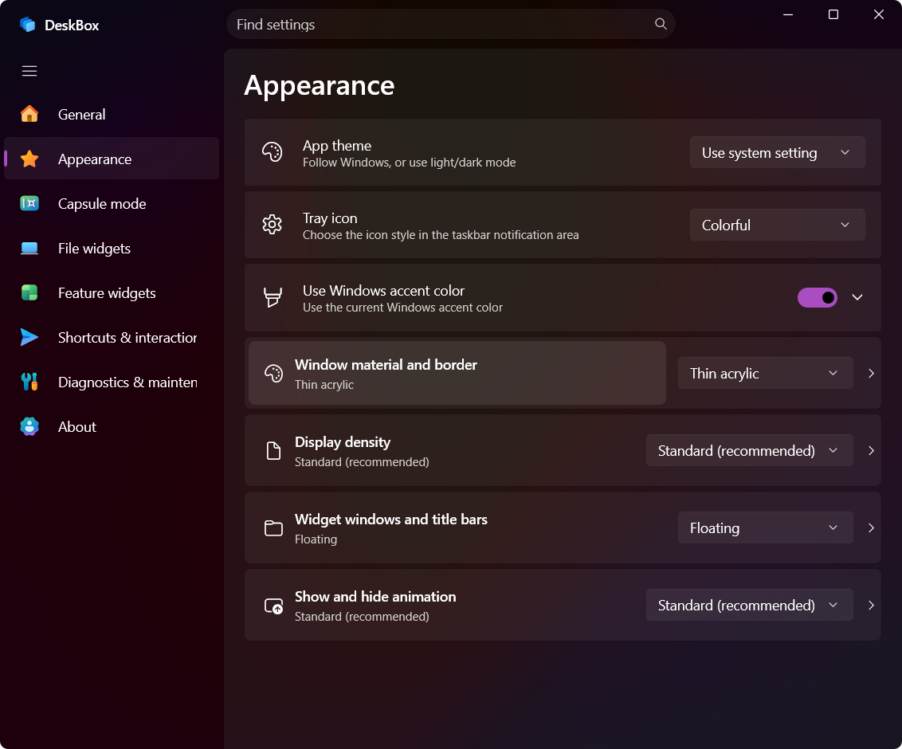
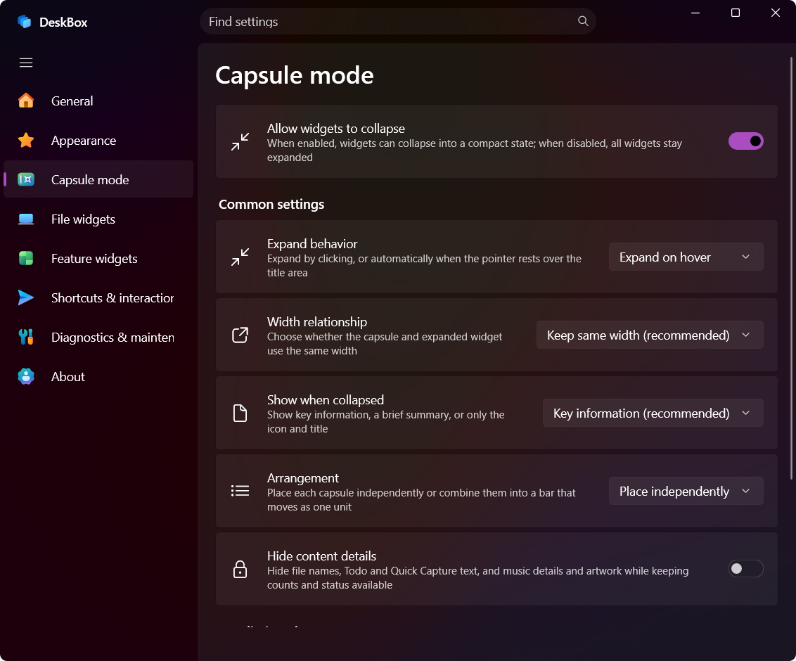
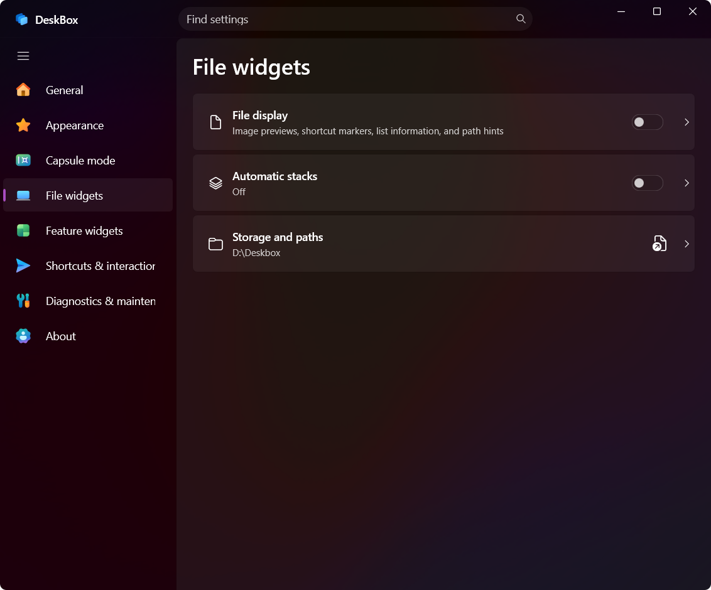
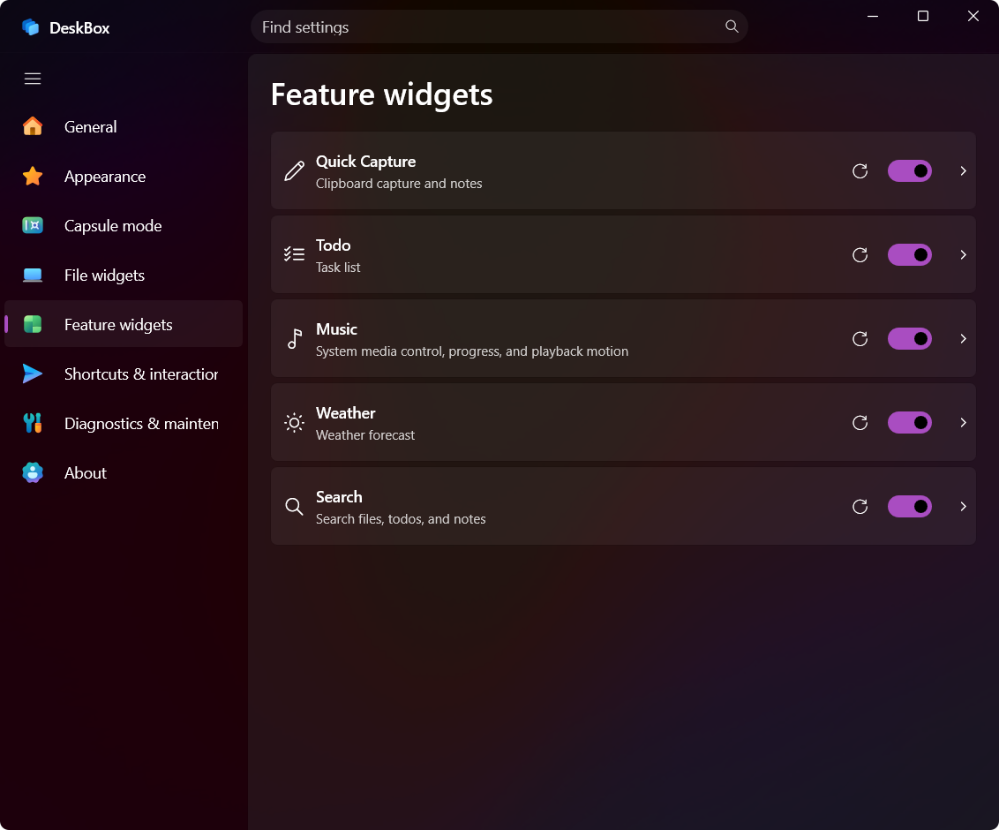
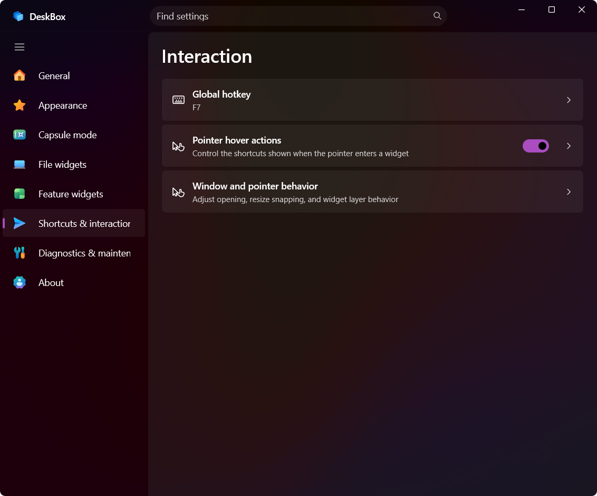

# DeskBox

**A local-first Windows 11 desktop organizer for files, folders, todos, quick notes, search, weather, and music controls.**

English | [简体中文](README.zh-CN.md)

[](https://github.com/Tianyu199509/DeskBox/actions/workflows/ci.yml)
[](https://github.com/Tianyu199509/DeskBox/releases/tag/v1.3.4)
[](#system-requirements)
[](#download)
[](LICENSE)


DeskBox adds native-feeling WinUI 3 widgets to the Windows desktop without replacing Explorer or changing how your files work. Create a desktop file organizer backed by a real folder, map an existing folder, keep todos and quick notes close at hand, search the PC, view weather, or control the active media session. Widgets can stay expanded, collapse into compact capsules, or be raised temporarily from the tray or a global hotkey.

## DeskBox at a glance

| | |
| --- | --- |
| **Platform** | Windows 11, x64 and ARM64 |
| **Technology** | C#, WinUI 3, .NET 10, Windows App SDK 2.2 |
| **Storage model** | Local-first; files, notes, tasks, settings, and layouts remain on the PC |
| **Languages** | English, Simplified Chinese, Japanese, German, Brazilian Portuguese |
| **License** | GPL-3.0-only |

## Download

Download DeskBox 1.3.4 from [GitHub Releases](https://github.com/Tianyu199509/DeskBox/releases/tag/v1.3.4):

- [DeskBox 1.3.4 for x64](https://github.com/Tianyu199509/DeskBox/releases/download/v1.3.4/DeskBox_Setup_1.3.4_x64.exe) — most Intel and AMD PCs.
- [DeskBox 1.3.4 for ARM64](https://github.com/Tianyu199509/DeskBox/releases/download/v1.3.4/DeskBox_Setup_1.3.4_arm64.exe) — Snapdragon, Surface Pro X, and other Windows on ARM PCs.

The installers are framework-dependent, so they stay smaller and do not bundle a private runtime. Setup checks the matching architecture of .NET 10 Runtime and Windows App Runtime 2.2. An existing compatible runtime is reused; a missing dependency is downloaded and installed during setup.

> Internet access is needed only when setup must download a missing runtime. Windows may request administrator permission for that dependency installation; DeskBox itself installs for the current user by default.

## Features

### File organizer and folder widgets

- Create managed file widgets backed by ordinary folders, or map an existing folder without moving it.
- Use icon or list layouts, title styles, sorting, auto stacks, adjustable icon sizes, and compact display density.
- Drag files in or out, copy, cut, paste, rename, delete, reveal in Explorer, and open shortcuts through the Windows shell.
- Drop content from Explorer, WeChat, or a browser; remote image and file URLs can be downloaded and imported.
- Preview supported files through a running [QuickLook](https://github.com/QL-Win/QuickLook) instance by pressing Space.

### Todo and Quick Capture

- Track tasks with due dates, reminders, recurrence, color markers, attachments, filters, and batch actions.
- Save reusable text, links, images, and files in Quick Capture with pinning, paper styles, attachments, and focused editing.
- Keep attachment files linked to their original location or copy them into DeskBox-managed storage.

### Desktop search

- Search files, folders, applications, settings, and DeskBox content from one popup or search widget.
- Combine the Windows index with an optional local USN-based file index.
- Use configurable filters, result limits, history, favorites, and a global search hotkey.
- The popup shell is warmed during idle time so a widget click can show and focus it first, while recommendations, icons, and an idle-unloaded local index recover in the background.
- The resident local index can unload after search has been idle while lightweight file watchers continue tracking changes; disabling Search releases the complete search runtime.

### Weather and music

- View current conditions plus hourly and multi-day forecasts with MSN Weather and automatic Open-Meteo fallback.
- Choose a theme-aware Standard weather skin or the richer condition-based skin, with responsive Day and Week views across widget sizes.
- Control the active Windows media session, playback mode, progress, and system volume from the music widget.
- Use responsive cover, controls, record, and compact layouts with optional album-color ambience.

### Capsule mode and native Windows behavior

- Collapse widgets into smart capsules with click-to-toggle or hover-to-expand behavior.
- Show key information, a short summary, or only an icon and title; hide sensitive Todo and Quick Capture text while collapsed.
- Arrange capsules independently or combine them into a movable, ordered bar.
- Raise or hide all widgets from the tray or a configurable global hotkey.
- Customize Mica/acrylic materials, opacity, borders, DWM corners, animation, title bars, icon size, and text size.

## What is new in 1.3.4

- **More predictable resource use:** disabled feature widgets and closed Settings release their visual trees, music and capsule timers detach correctly, caches are bounded, and guarded idle maintenance can reclaim memory even while visible widgets remain on the desktop.
- **Search opens first:** the popup shell is prewarmed, repeated widget clicks only open or focus it, and the native window paints before recommendations, icons, or an idle-unloaded index reload. Search results also keep a visible fallback icon.
- **Search releases its resident index:** after five minutes without Search, the large custom index can leave memory while its lightweight watchers continue recording changes; invoking the popup starts restoring it immediately, before the first query.
- **Weather redesign:** responsive Day/Week layouts, refined Standard and Rich skins, condition-aware contrast, a compact sunrise arc, and clearer forecast hierarchy replace the previous crowded layout. Rich is the new-user and reset default, and continuous decorative weather effects have been removed.
- **Music stability and efficiency:** track changes wait for complete metadata to avoid title/artist flicker, cover decoding is deduplicated and bounded, marquee/vinyl work stops while hidden or collapsed, and playback versus secondary control sizing is more consistent.
- **Safer capsule interaction:** expanded layouts prewarm during idle time, first hover works after startup or wake without a click, overlapping capsules no longer react through the active widget, and click-to-toggle widgets collapse immediately from the title bar.
- **Correct window layering:** hover expansion no longer lets a capsule overtake the current foreground application after a temporary tray/F7 raise.
- **Sharper icons:** large file and shortcut icons use higher-resolution shell sources, small icons use improved downsampling, and stacked icons follow the configured size.
- **Stability and menu fixes:** shortcuts launch through a Shell-compatible path; Todo and Quick Capture blank areas expose their title-bar menu; file and mapped-folder content menus add title style, expansion mode, and Close widget with confirmation; Paste appears only when usable.
- **Hotkey reliability:** low-level keyboard hooks were removed, RDP modifier-key recovery was improved, and the search hotkey follows the search feature switch.
- **Release packaging:** application and installer versions are aligned to 1.3.4; framework-dependent x64 and ARM64 installers detect and download only missing architecture-matched runtimes. The legacy image-gallery widget has also been removed.

Read the full [changelog](CHANGELOG.md) or the [1.3.4 release notes](docs/releases/v1.3.4.md).

## Current interface

These screenshots come from the 1.3.4 build.

### Desktop widgets and materials

#### Mica



#### Acrylic



### Settings

| General | Appearance |
| --- | --- |
|  |  |

| Capsule mode | File widgets |
| --- | --- |
|  |  |

| Feature widgets | Shortcuts & interaction |
| --- | --- |
|  |  |

## Local-first data and privacy

DeskBox does not require an account or cloud synchronization. Widget configuration, todos, quick notes, search history, layouts, and managed files are stored locally.

Some actions intentionally use the network:

- Weather requests use MSN Weather or Open-Meteo.
- Update checks contact the DeskBox update endpoint or GitHub Releases.
- Setup downloads .NET or Windows App Runtime only when the selected architecture is missing.
- A remote URL dragged from a browser is downloaded only when you import it.

Capsule privacy mode hides selected text in the collapsed presentation; it is a presentation control, not file encryption.

## System requirements

- Windows 11 version 22H2 or later.
- x64 or ARM64 processor matching the installer.
- .NET 10 Runtime and Windows App Runtime 2.2; setup can install either dependency when missing.

Windows 10 may work in some environments, but it is not a validated target.

## Installation, updates, and removal

DeskBox uses an Inno Setup installer and installs for the current user by default. Overwrite installation preserves app settings, widget configuration, and managed storage. Older administrator-level installations under Program Files are migrated to avoid elevated-process drag-and-drop restrictions.

Startup launch is tray-first and silent. If DeskBox is already running, a second startup instance exits instead of opening another settings window.

During uninstall, you can choose whether to remove app-local data under `%LocalAppData%\DeskBox`. DeskBox does not silently delete managed user files; setup asks before any cleanup that could affect them.

## FAQ

### Is DeskBox a Windows desktop replacement?

No. Explorer remains the desktop shell, and files remain normal files and folders. DeskBox adds independently managed widgets above the existing desktop.

### Where does DeskBox store data?

- App settings and widget data: `%LocalAppData%\DeskBox\data`
- Default managed file storage: `%UserProfile%\DeskBox`

Both locations can be backed up from DeskBox settings.

### Which installer should I choose?

Choose x64 for almost all Intel and AMD Windows PCs. Choose ARM64 for native Windows on ARM devices such as Snapdragon PCs. Check **Settings → System → About → System type** if unsure.

### Why can the installer need the internet?

Release installers do not contain the .NET 10 or Windows App Runtime 2.2 payload. Setup first checks the PC and downloads only a missing architecture-specific dependency.

### Does disabling a feature widget remove its data?

No. Disabling a feature closes its UI and releases runtime resources, while its saved configuration remains available for the next time you enable it.

## Build from source

Development requires the .NET 10 SDK and a Windows 11 environment. Visual Studio with the Windows App SDK workload is recommended.

Restore, test, and build the x64 Debug version:

```powershell
dotnet restore .\DeskBox.sln -p:Platform=x64
dotnet test .\DeskBox.sln --configuration Debug --no-restore -p:Platform=x64 -v:minimal
dotnet build .\src\DeskBox\DeskBox.csproj --configuration Debug --no-restore -p:Platform=x64 -v:minimal
```

Create framework-dependent Release outputs:

```powershell
dotnet publish .\src\DeskBox\DeskBox.csproj --configuration Release -p:Platform=x64 -p:RuntimeIdentifier=win-x64 -p:SelfContained=false -p:WindowsAppSDKSelfContained=false -o .\artifacts\publish\DeskBox\x64 -v:minimal
dotnet publish .\src\DeskBox\DeskBox.csproj --configuration Release -p:Platform=ARM64 -p:RuntimeIdentifier=win-arm64 -p:SelfContained=false -p:WindowsAppSDKSelfContained=false -o .\artifacts\publish\DeskBox\arm64 -v:minimal
```

With Inno Setup 6 or newer installed, compile both installers:

```powershell
ISCC.exe .\installer\DeskBox.iss
ISCC.exe .\installer\DeskBox.arm64.iss
```

Expected outputs:

```text
Output\DeskBox_Setup_1.3.4_x64.exe
Output\DeskBox_Setup_1.3.4_arm64.exe
```

## Project layout

```text
src\DeskBox                 WinUI 3 application
src\DeskBox.Updater         direct-release updater helper
tests\DeskBox.Tests         service and policy tests
installer                   x64/ARM64 Inno Setup scripts
docs\user-guide             product documentation
docs\images                 README and release imagery
docs\releases               release copy and test checklists
```

## Feedback and localization

DeskBox is currently developed and maintained by a solo developer. External pull requests are not being accepted at this stage so the project can keep a consistent architecture and clear copyright boundaries, but bug reports, feature requests, translations, and UI/UX feedback are welcome through [GitHub Issues](https://github.com/Tianyu199509/DeskBox/issues).

Special thanks to [@magisph](https://github.com/magisph) for the Brazilian Portuguese localization.

You can also visit [deskbox.fun](https://deskbox.fun) or use the contact information in the app's About page.

## Author and license

- Developer: Tianyu Zhu
- Repository: <https://github.com/Tianyu199509/DeskBox>
- License: [GPL-3.0-only](LICENSE)

Earlier DeskBox versions already published under the MIT License remain available under that license. The change is not retroactive; see [LICENSE_CHANGE.md](LICENSE_CHANGE.md).
