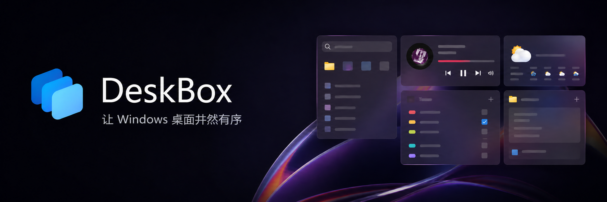
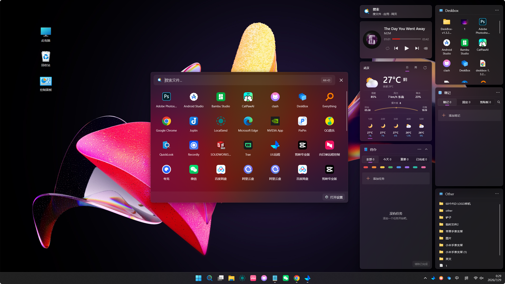
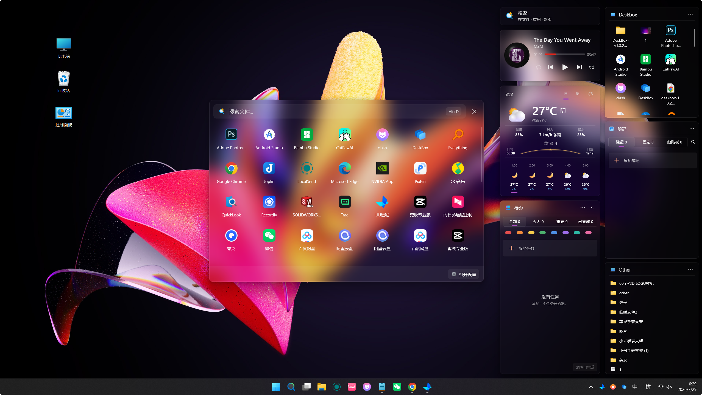
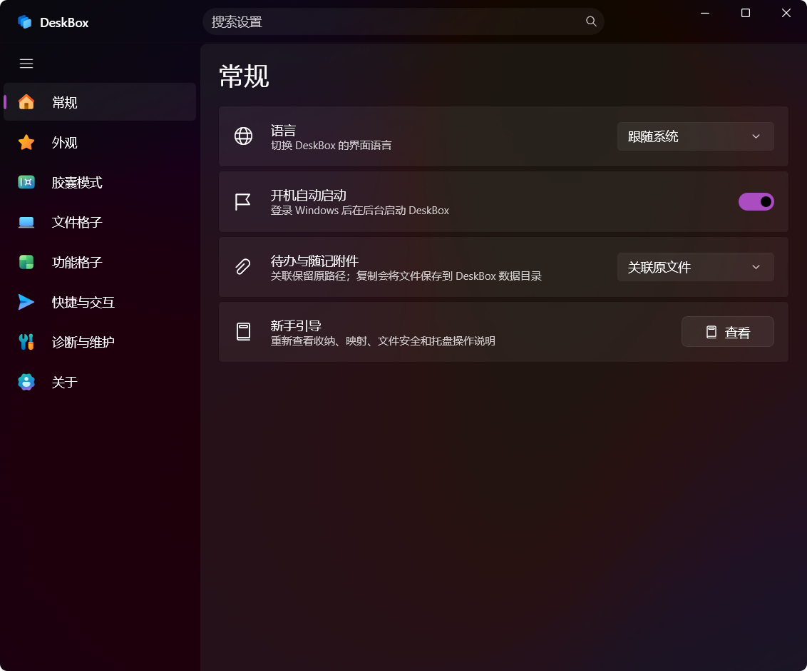
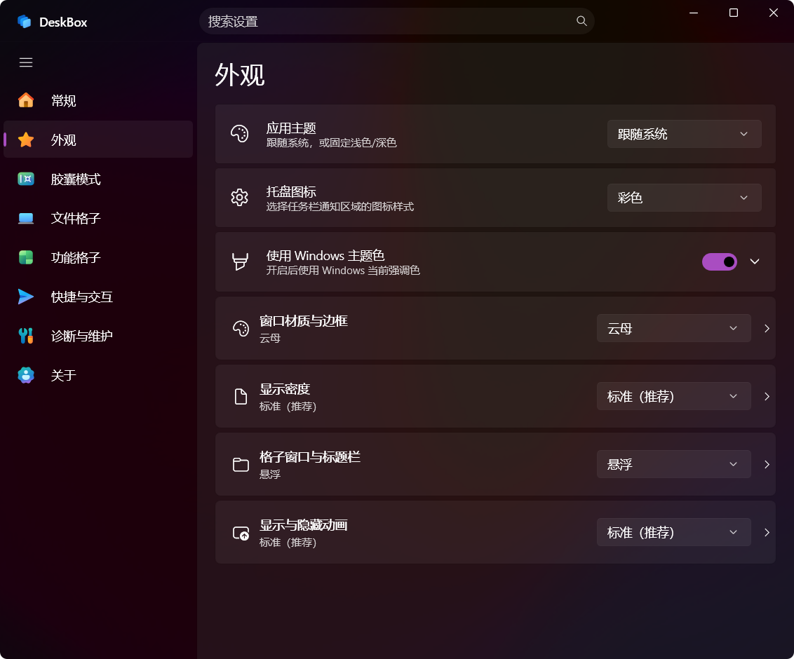
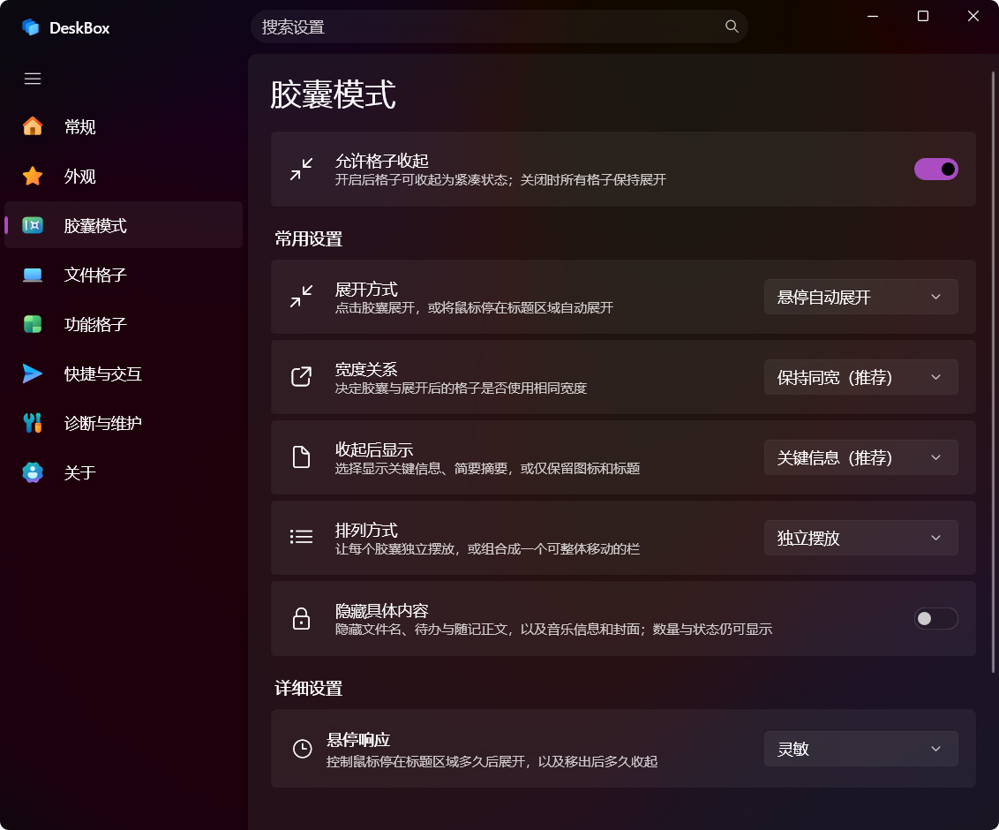
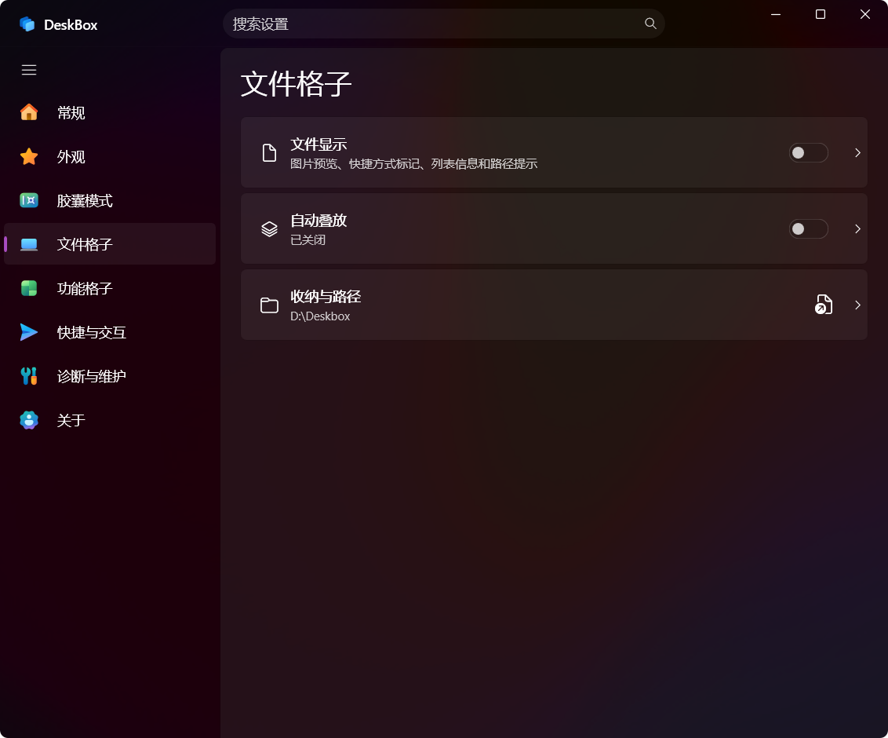
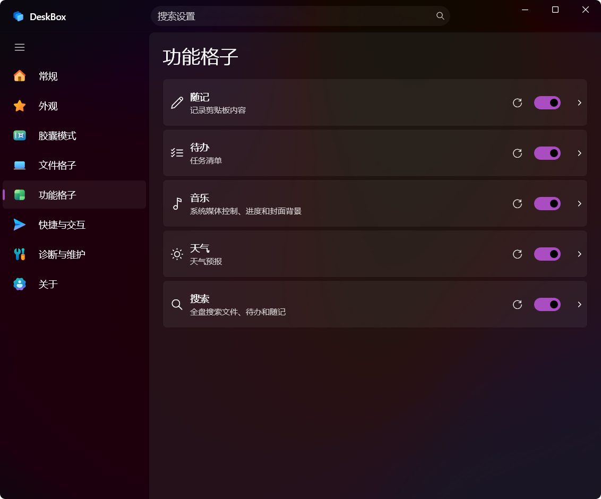
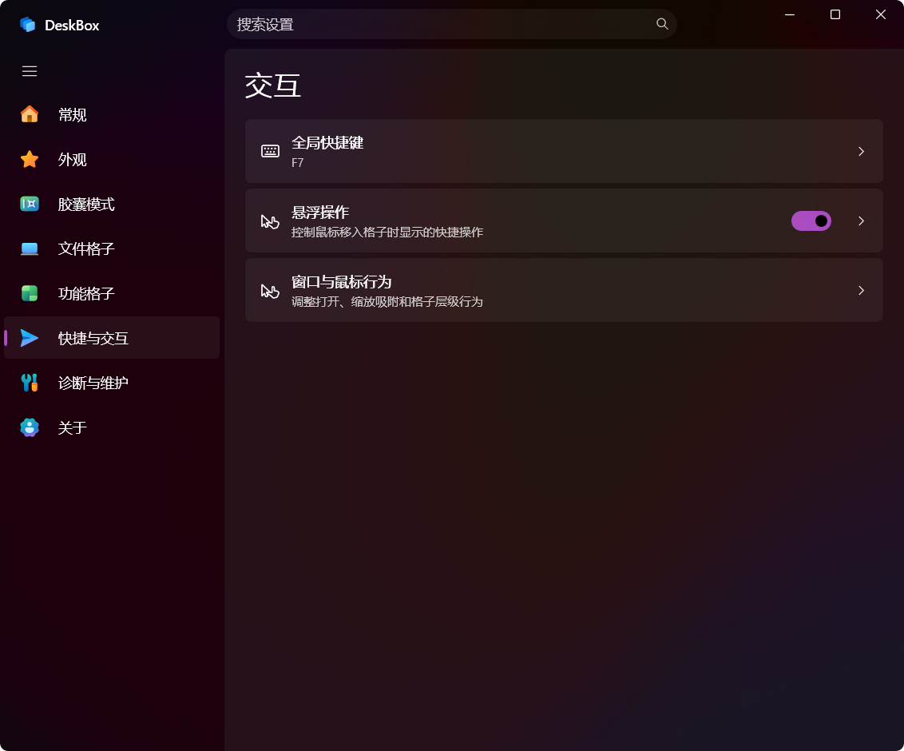

# DeskBox

**本地优先的 Windows 10/11 桌面整理工具：用格子管理文件、文件夹、待办、随记、搜索、天气和音乐。**

简体中文 | [English](README.md)

[](https://github.com/Tianyu199509/DeskBox/actions/workflows/ci.yml)
[](https://github.com/Tianyu199509/DeskBox/releases/tag/v1.4.1)
[](#环境要求)
[](#下载)
[](LICENSE)



DeskBox 基于 C#、WinUI 3 和 Windows App SDK 构建，在原生 Windows 桌面上增加一层轻量格子，但不会替换资源管理器，也不会改变文件原本的使用方式。你可以创建真实文件夹支撑的文件格子、映射已有文件夹、记录待办与随记、搜索电脑内容、查看天气或控制当前音乐。格子既能保持展开，也能收起成胶囊，并可通过托盘或全局快捷键临时唤起。

## 桌面上的 Mica 与 Acrylic

DeskBox 使用贴近 Windows 原生体验的材质，同时保留普通桌面文件与文件夹原本的使用方式。

| Mica 云母 | Acrylic 亚克力 |
| --- | --- |
|  |  |

## DeskBox 概览

| | |
| --- | --- |
| **支持平台** | Windows 10/11，x64 与 ARM64 |
| **技术栈** | C#、WinUI 3、.NET 10、Windows App SDK 2.2 |
| **数据方式** | 本地优先；文件、随记、待办、设置与布局保存在电脑上 |
| **界面语言** | 简体中文、English、日本語、Deutsch、Português do Brasil、हिन्दी、Español、Français、العربية、বাংলা、Русский |
| **开源协议** | GPL-3.0-only |

新增的 6 种语言优先覆盖文件格子和新手流程等主要体验；少量详细设置仍在持续翻译，暂时使用英文显示。

## 下载

DeskBox 1.4.2 安装包正在本地验证，暂不上传 GitHub。当前公开稳定版仍可在 [GitHub Releases](https://github.com/Tianyu199509/DeskBox/releases/tag/v1.4.1) 下载。

- [DeskBox 1.4.1 x64 安装包](https://github.com/Tianyu199509/DeskBox/releases/download/v1.4.1/DeskBox_Setup_1.4.1_x64.exe)，适用于大多数 Intel 和 AMD 电脑。
- [DeskBox 1.4.1 ARM64 安装包](https://github.com/Tianyu199509/DeskBox/releases/download/v1.4.1/DeskBox_Setup_1.4.1_arm64.exe)，适用于骁龙、Surface Pro X 等 Windows on ARM 电脑。

安装包采用框架依赖方式，不会把一整套运行时打进安装包。安装程序会检测对应架构的 .NET 10 Runtime 和 Windows App Runtime 2.2：电脑里已有兼容版本就直接复用，缺少时才联网下载并安装。

> 只有缺少运行时依赖时，安装阶段才需要联网下载。Windows 可能为依赖安装弹出管理员权限确认；DeskBox 本体默认安装到当前用户目录。

## 核心功能

### 文件整理与文件夹格子

- 创建由普通文件夹支撑的收纳格子，或把已有文件夹直接映射到桌面，不改变原文件位置。
- 支持图标/列表布局、标题样式、详细信息和路径开关、手动或规则排序、自动叠放、图标大小和显示密度设置。
- 可直接调整项目顺序、把文件移动或复制到格子内的文件夹；新建文件夹时自动滚动到对应位置并进入名称输入，手动顺序可在重启后恢复。
- 支持文件和快捷方式拖入、拖出、复制、剪切、粘贴、重命名、删除、打开与在资源管理器中显示；拖到 Windows 桌面时保持 Shell 兼容行为。
- 可从资源管理器、微信或浏览器拖入内容；浏览器中的远程图片与文件链接可以下载后导入。
- 已运行 [QuickLook](https://github.com/QL-Win/QuickLook) 时，可在格子中按空格预览支持的文件。

### 格子组与桌面整理

- 文件格子可以在不改变底层文件夹的情况下合并成组，并通过标题、鼠标滚轮或可循环的 Ctrl+Tab 快捷键切换成员。
- 支持安全拆出成员或解散格子组；组内与独立文件格子共用视图、设置、菜单、排序、拖放和 QuickLook 交互。
- 桌面整理会先按类别预览将要移动的内容，每类可选择新建文件夹或复用已有格子。
- 可在下载、解压和同路径替换达到稳定状态后，自动整理新出现的桌面文件。

### 待办与随记

- 待办与随记使用响应式列表/详情布局，宽屏可双栏展示并调整列表宽度，窄屏会自动切换为单页浏览。
- 待办支持截止日期、提醒、重复、颜色标记、Markdown 备注、多附件、筛选与批量操作。
- 随记支持文本、链接、图片和文件，提供固定、纸张样式、Markdown 编辑与预览、附件删除和专注编辑。
- 附件可以关联原文件，也可以复制到 DeskBox 管理的数据目录。

### 桌面搜索

- 在一个搜索弹窗或搜索格子中查找文件、文件夹、应用、设置与 DeskBox 内容。
- 可组合使用 Windows 索引与可选的本地 USN 文件索引。
- 支持结果筛选、可排序详细列、数量设置、历史、收藏和独立全局快捷键。
- 支持 Ctrl/Shift 多选、带边缘自动滚动的框选，以及对选中结果执行批量操作。
- 搜索结果按阶段增量返回；单个搜索来源异常时会被隔离，不影响其他来源继续工作。
- 空闲时预热搜索弹窗外壳，点击搜索格子后优先显示并聚焦窗口，推荐内容、图标与已卸载的本地索引在后台恢复。
- 搜索空闲后可卸载常驻的本地索引，同时保留轻量文件监听记录变化；关闭搜索功能则会释放完整搜索运行资源。

### 天气与音乐

- 天气格子可展示实时天气、逐小时和多日预报，默认使用 MSN 天气，失败时自动回退到 Open-Meteo。
- 天气提供跟随明暗模式的标准皮肤和按天气变化的高级皮肤，日/周视图会随格子尺寸响应式调整。
- 音乐格子通过 Windows 媒体会话控制当前播放器，支持播放模式、进度和系统音量。
- 音乐提供封面、控制、唱片与紧凑布局，并可选择跟随专辑封面的氛围色。

### 胶囊模式与原生交互

- 格子可收起为智能胶囊，支持点击切换或鼠标悬停自动展开。
- 收起后可显示关键信息、简要摘要或仅图标与标题；待办和随记可隐藏敏感正文。
- 胶囊可以独立摆放，也可以组合成可整体移动、可排序的胶囊栏。
- 可通过托盘和自定义全局快捷键显示、隐藏或临时唤起全部格子；连续触发会串行处理，并可在显示器、DPI、睡眠唤醒和资源管理器变化后恢复。
- 支持云母/亚克力材质、透明度、边框、DWM 圆角、动画、标题栏、图标与文字大小。

### 更新、备份与诊断

- 支持应用内检查更新，在独立界面阅读较长的更新日志；下载失败时可重试或前往官网继续下载。
- DeskBox 关闭后会显示安装界面；升级会复用并锁定原安装路径，避免生成第二份应用。
- 支持设置备份与恢复，并可导出经过隐私过滤的一键诊断包用于排查问题。
- 设置使用可恢复快照，退出时刷新待保存内容；保存失败会明确记录和提示，不再静默恢复默认配置。

## 1.4.2 更新亮点

- **待办勾选不再错位。** 完成状态按实际任务同步，自定义排序、筛选和列表容器复用时不会误勾其他任务；在“已完成”中取消勾选只移出当前任务。
- **随记图片与附件更直观。** 剪贴板图片在列表和详情中直接显示缩略图，复制时写回图片本身；随记与待办共用横向附件方块，可显示图片缩略图或文件图标，并支持悬浮删除。
- **音乐控制更接近 Windows。** 播放、暂停、上一首和下一首改为统一尺寸的面性图标，封面模式控制条、歌曲信息和悬浮质感同步调整。
- **格子组连续滚动更顺手。** 移除会吞掉快速输入的双重时间限制，保留触控板步长合并、最终目标优先和首尾循环，持续向下滚动可循环切换。
- **界面与运行可靠性继续收紧。** 补齐随记/固定空状态、固定页直接新增、浅深色拖动手势条、Markdown 图片与复杂内容显示，以及搜索索引和桌面层级的内存安全保护。

完整内容见 [更新日志](CHANGELOG.md) 和 [1.4.2 发布说明](docs/releases/v1.4.2.md)。

## 当前界面

以下图片用于展示当前 DeskBox 的设置界面。

### 设置

| 常规 | 外观 |
| --- | --- |
|  |  |

| 胶囊模式 | 文件格子 |
| --- | --- |
|  |  |

| 功能格子 | 快捷与交互 |
| --- | --- |
|  |  |

## 本地数据与隐私

DeskBox 不要求注册账号，也不依赖云同步。格子配置、待办、随记、搜索历史、窗口布局和收纳文件都保存在本机。

以下功能会按使用意图联网：

- 天气数据来自 MSN 天气或 Open-Meteo。
- 更新检查访问 DeskBox 更新服务或 GitHub Releases。
- 安装器只在缺少依赖时下载 .NET 或 Windows App Runtime。
- 从浏览器拖入远程链接时，只有确认导入的内容会被下载。

胶囊隐私选项只是在收起状态下隐藏部分文字，属于展示控制，并不等同于文件加密。

## 环境要求

- Windows 10 21H2（build 19044）或更高版本；Windows 11 22H2 或更高版本可获得完整视觉效果。
- 与安装包匹配的 x64 或 ARM64 处理器。
- .NET 10 Runtime 与 Windows App Runtime 2.2；缺少时可由安装程序自动安装。

Windows 10 会自动降级不受系统支持的材质、圆角和部分动画；文件同步、拖放与格子核心功能仍按兼容基线验证。

## 安装、更新与卸载

DeskBox 使用 Inno Setup 安装器，默认安装到当前用户目录。覆盖安装会保留应用设置、格子配置和收纳目录。旧版如果安装在 Program Files，安装器会进行迁移，以避免管理员权限进程影响资源管理器拖拽。

开机自启会静默启动到托盘。DeskBox 已运行时，再启动一个实例会直接退出，不会重复打开设置窗口。

卸载时会明确提供“保留应用数据”和“彻底删除应用数据”两个选择。彻底删除会清理 `%LocalAppData%\DeskBox`、`%LocalAppData%\DeskBox-Recovery`、临时文件和 DeskBox 自己创建的注册信息；收纳路径中的用户文件始终保留。静默卸载默认保留应用数据，管理员只有显式传入 `/PURGEUSERDATA` 才会执行彻底清理。

## 常见问题

### DeskBox 会替换 Windows 桌面吗？

不会。Windows 资源管理器仍是桌面外壳，文件也仍是普通文件和文件夹。DeskBox 只是在现有桌面上增加独立管理的格子。

### DeskBox 把数据保存在哪里？

- 应用设置和格子数据：`%LocalAppData%\DeskBox\data`
- 新用户收纳目录：优先使用空间充足的非系统固定磁盘，例如 `D:\DeskBox\用户名`；没有合适磁盘时回退到 `%UserProfile%\DeskBox`

两类数据都可以通过 DeskBox 设置中的备份功能进行备份。

### 应该下载 x64 还是 ARM64？

绝大多数 Intel、AMD 电脑选择 x64；骁龙等原生 Windows on ARM 设备选择 ARM64。不确定时可在“Windows 设置 → 系统 → 系统信息 → 系统类型”中查看。

### 为什么安装时可能需要联网？

正式安装包不内置 .NET 10 和 Windows App Runtime 2.2。安装器会先检查电脑，只下载当前架构缺少的依赖。

### 关闭功能格子会删除内容吗？

不会。关闭功能会关闭对应界面并释放运行资源，但保存的数据和配置仍会保留，下次开启后继续使用。

## 从源码构建

开发需要 .NET 10 SDK 和 Windows 11 环境，推荐安装带 Windows App SDK 工作负载的 Visual Studio。

还原、测试并构建 x64 Debug 版本：

```powershell
dotnet restore .\DeskBox.sln -p:Platform=x64
dotnet test .\DeskBox.sln --configuration Debug --no-restore -p:Platform=x64 -v:minimal
dotnet build .\src\DeskBox\DeskBox.csproj --configuration Debug --no-restore -p:Platform=x64 -v:minimal
```

生成不内置运行时的 Release 输出：

```powershell
dotnet publish .\src\DeskBox\DeskBox.csproj --configuration Release -p:Platform=x64 -p:RuntimeIdentifier=win-x64 -p:SelfContained=false -p:WindowsAppSDKSelfContained=false -o .\artifacts\publish\DeskBox\x64 -v:minimal
dotnet publish .\src\DeskBox\DeskBox.csproj --configuration Release -p:Platform=ARM64 -p:RuntimeIdentifier=win-arm64 -p:SelfContained=false -p:WindowsAppSDKSelfContained=false -o .\artifacts\publish\DeskBox\arm64 -v:minimal
```

安装 Inno Setup 6 或更高版本后，编译两个安装包：

```powershell
ISCC.exe .\installer\DeskBox.iss
ISCC.exe .\installer\DeskBox.arm64.iss
```

预期输出：

```text
Output\DeskBox_Setup_1.4.2_x64.exe
Output\DeskBox_Setup_1.4.2_arm64.exe
```

## 项目结构

```text
src\DeskBox                 WinUI 3 应用源码
src\DeskBox.Updater         直发版更新辅助程序
tests\DeskBox.Tests         服务与策略测试
installer                   x64/ARM64 Inno Setup 脚本
docs\user-guide             产品使用说明
docs\images                 README 与发布图片
docs\releases               版本发布文案和测试清单
```

## 反馈与本地化

DeskBox 目前由个人独立开发和维护。为了保持架构一致性与后续版权边界，现阶段暂不接受外部 Pull Request；欢迎通过 [GitHub Issues](https://github.com/Tianyu199509/DeskBox/issues) 提交问题、功能建议、翻译和 UI/UX 反馈。

特别感谢 [@magisph](https://github.com/magisph) 提供巴西葡萄牙语本地化支持。

也可以访问 [deskbox.fun](https://deskbox.fun)，或通过应用“关于”页面中的联系方式反馈。

## 作者与协议

- 开发者：朱天雨
- 项目地址：<https://github.com/Tianyu199509/DeskBox>
- 开源协议：[GPL-3.0-only](LICENSE)

早期已按 MIT 协议发布的 DeskBox 版本继续保持原许可，协议变更不追溯历史版本；详情见 [LICENSE_CHANGE.md](LICENSE_CHANGE.md)。
