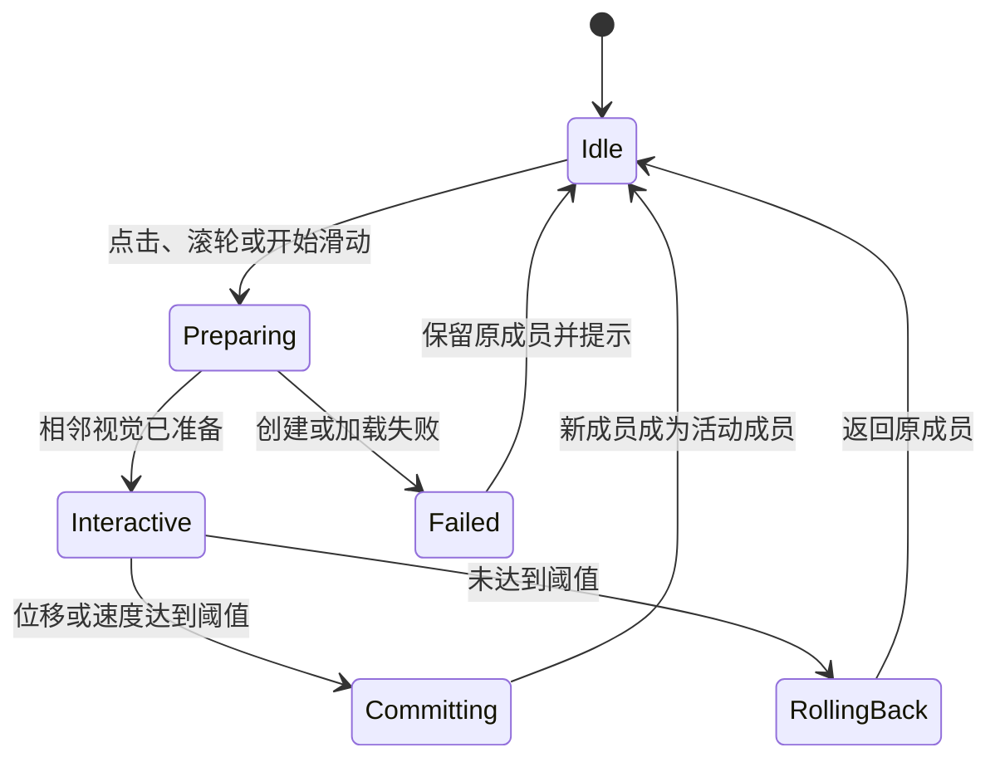

# DeskBox 格子组标题栏导航规范（2026-07-29）

> **替代声明**  
> 本节是当前唯一有效规范，替代下方历史正文中的“外部附着导航条”“Auto / Tabs / Stack”“叠放拖拽/跟手”“Overlay/Hidden/System 标题栏兼容”等方案。实现、测试和验收发生冲突时，以本节为准；旧正文只保留决策背景，不得作为新增实现依据。

## R0. 已确认结论

格子组只在现有标题栏内提供一个常驻成员选择器，不增加第二行导航、内容区选择按钮、外置标签条、嵌套胶囊或视觉卡片堆。

- 点击是主路径：点击当前成员身份，打开锚定成员列表并直接选择。
- 局部滚轮是可选增强：只有指针位于选择器热区时切换，可关闭。
- 键盘是完整等价路径：支持打开列表、直选和前后切换。
- 组级标题展示支持 `IconAndText`、`IconOnly`、`TextOnly`。
- 只有 Standard 和 Compact 可分组；Overlay、Hidden、System 分组前后均禁用。
- 切换不改变 `SurfaceId`、HWND、位置、尺寸、层级、锁定、展开或胶囊状态。
- 图标、文字和内容在目标首帧后原子提交；失败、取消、超时和保存失败完整回滚。
- 本功能零新增第三方依赖，优先使用 WinUI、Windows 平台能力和项目已有微软 Toolkit。

## R1. 术语和架构不变量

| 术语 | 定义 |
|---|---|
| `GroupId` | 组合业务身份，用于成员关系、排序和管理。 |
| `SurfaceId` | 组合持久表现身份；现有 `WidgetGroupConfig.SurfaceId` 即规范字段。 |
| `MemberId` | 成员业务身份，拥有配置、数据和业务状态。 |
| `ActiveMemberId` | 当前完整提交成功的活动成员。 |
| Surface Session | 按 `SurfaceId` 建立的宿主、索引、事务和输入状态。 |
| 标题成员选择器 | 标题栏内常驻、显示活动成员并打开成员列表的唯一组导航。 |

必须满足：

- 稳定状态一个可见组合只有一个顶层 HWND、一个 registry 条目和一个实时活动成员。
- 以 `SurfaceId` 为宿主主键，以 `MemberId` 建索引；切换不得 re-key Surface。
- 选择器属于 Surface，不属于活动成员，切换不得销毁整个选择器。
- 折叠、展开和成员切换复用同一 HWND；应用重启后允许获得新 HWND。
- 释放成员视觉不等于停止音乐会话等长期业务服务，也不能丢失业务状态。
- 跨宿主换窗可在迁移期保留，但任何当前类型仍进入该路径，都表示统一宿主尚未完成。

## R2. 唯一标题栏选择器

```text
┌ [成员图标] 当前成员  2/4  ▾      可拖动区域      ⋯  ︿ ┐
│                         当前成员内容                  │
└──────────────────────────────────────────────────────┘
```

### R2.1 视觉

- 图标、名称、位置和箭头使用固定槽位；右侧公共命令锚点稳定。
- 静止时不绘制常驻厚重胶囊、堆叠描边、额外阴影或第二层标题容器。
- 悬停只显示轻量圆角底色；按下或 Flyout 展开时加深一级。
- 使用系统主题、圆角、焦点和高对比度资源。
- 选择器交互区从标题栏拖动区排除，其余空白继续用于移动窗口。
- 名称单行省略，不得推动位置、公共命令和窗口按钮。
- 右侧只保留组内公共命令；成员专属命令进入内容或更多菜单。
- 组名不与成员名争抢标题主区域，可放入 Flyout 或管理页。

### R2.2 点击主路径

点击选择器打开原生锚定 Flyout。列表始终显示成员图标和完整名称，当前项使用系统选中背景和勾选。

- 可直接选择任意成员；非相邻选择不闪过中间成员。
- 点击当前成员不重建内容、不播放动效。
- 目标准备超过 150ms 才在目标项显示轻量进度。
- 失败时保留当前项和内容，并给出非阻塞提示。
- 排序、移出和解散位于明确管理分区，不与普通选择混排。

### R2.3 局部滚轮

- 仅在选择器热区且 `WheelSwitchEnabled=true` 时生效。
- 内容区、标题拖动区、窗口边缘和 Flyout 内滚轮不得切换。
- 向下选择后一个，向上选择前一个；首尾停止，不循环。
- 普通滚轮每个明确刻度最多一次意图；高分辨率滚轮/触控板累计到阈值再提交。
- 指针进入热区约 150ms 后启用；提交后冷却约 180–220ms。
- 冷却期间输入合并为最后目标，不排队播放中间成员。
- Flyout 展开、窗口拖动、调整大小或冲突输入期间不响应。
- 关闭滚轮后，点击和键盘仍完整可用；不提供“仅滚轮”。

### R2.4 键盘和触控

- 选择器聚焦时，`Alt+↓`、`Enter` 或 `Space` 打开列表。
- `Ctrl+Tab` 切换后一个，`Ctrl+Shift+Tab` 切换前一个。
- Flyout 使用方向键、`Enter` 和 `Esc`。
- 快捷键只在对应 Surface/格子焦点上下文中路由。
- 不实现标题栏触摸/触控板拖拽跟手，避免与移动窗口冲突；触摸通过点击 Flyout 选择。

## R3. 组级标题展示

| 值 | 表现 | 约束 |
|---|---|---|
| `IconAndText` | 图标 + 名称 | 默认，识别性最高。 |
| `IconOnly` | 图标 | 保留下拉符号、Tooltip 和完整自动化名称。 |
| `TextOnly` | 名称 | 文字槽有最大宽度并省略，不推动命令。 |

- `TitleDisplayMode` 属于组，不随活动成员独立偏好变化。
- 图标槽固定；缺图标时使用稳定占位，不能让文字跳位。
- `2/4` 是辅助状态，可按明确宽度断点隐藏，但切换中不得改变布局。
- 不新增随成员名称宽度改变图文策略的 `Auto`。
- 现有图标颜色、线性/填充设置只控制绘制，不兼任标题布局。

建议字段：

```text
GroupChromeMode: Standard | Compact
TitleDisplayMode: IconAndText | IconOnly | TextOnly
WheelSwitchEnabled: bool
```

## R4. 标题栏模式限制

| Surface 状态 | Standard | Compact | Overlay | Hidden | System |
|---|---:|---:|---:|---:|---:|
| 独立格子 | 允许 | 允许 | 允许 | 允许 | 允许 |
| 合并来源或目标 | 允许 | 允许 | 禁止 | 禁止 | 禁止 |
| 已组成格子组 | 允许 | 允许 | 禁止 | 禁止 | 禁止 |

- 合并事务同时校验来源和目标的实际模式。
- Overlay、Hidden 或 System 阻止合并，并提示“格子组需要标准或紧凑标题栏，请先切换标题栏模式”。
- 不把天气、音乐等不可合并格子从候选中静默移除，必须显示禁用原因。
- 不自动改成 Standard 后继续合并。
- 成组后 Overlay、Hidden、System 继续可见但禁用，并说明原因。
- 全局默认、导入配置、快捷菜单和成员切换都不能绕过限制。
- 不自动解散组合；“解散后切换”必须由用户明确触发。
- 成组前记录成员独立标题偏好；移出或解散后恢复。偏好失效时使用安全默认。
- 旧“组合 + Overlay/Hidden/System/未知模式”统一迁移为 Standard。
- 迁移保留 `GroupId`、`SurfaceId`、顺序、活动成员、几何和业务数据，并有幂等诊断日志。
- 非法旧配置不得导致窗口不创建、成员消失或只剩后台进程。

胶囊是暂时展示状态，不是标题模式：收起时不增加第二套导航；保持 `ActiveMemberId`；展开后恢复选择器；进入前取消或安全 settle 切换；成员切换不得改变胶囊状态或几何。

## R5. 固定槽位微动效

- 不动画窗口位置、尺寸、圆角、标题栏高度、背景壳、公共命令和拖动区。
- 不使用整窗大幅滑动、旋转、缩放、3D 翻页、果冻弹簧或图标形变。
- 标题和内容只在固定裁剪区变化；动画可中断，新意图接管旧过渡而不排队。
- 箭头、位置槽和公共命令静止。
- 只有当前成员图标和文字在固定槽交叉淡化，建议 100–140ms。
- 旧图标淡出、新图标淡入；更多、菜单、折叠等公共图标不得改变。
- 标题身份、位置数字和 `ActiveMemberId` 在内容提交点同步更新。

| 触发 | 内容动效 | 时长 |
|---|---|---:|
| 滚轮/快捷键相邻切换 | 4–6px 方向微位移 + 淡化 | 160–180ms |
| Flyout 非相邻直选 | 交叉淡化 | 140–160ms |
| 重复选择当前成员 | 不播放 | 0ms |
| 系统关闭动画 | 无位移，短淡化或直接提交 | 0–80ms |

后一个从下方轻微进入，前一个方向反转。目标首帧就绪前不启动提交动效。

## R6. 首帧原子提交和回滚

所有成员类型执行同一事务：

1. **Begin**：为 Surface 建新请求代次，取消同 Surface 旧请求；其他 Surface 不受影响。
2. **Capture**：记录旧成员、标题、布局、胶囊、焦点和可回滚瞬态状态。
3. **Prepare**：初始化目标；旧内容保持可见、可交互。
4. **Present candidate**：目标 Loaded、非零布局，并完成挂载后的两个合成帧。
5. **Validate**：确认仍是最后意图、目标仍在组内、窗口未关闭且无冲突。
6. **Persist**：保存新 `ActiveMemberId`；失败不得改变已提交身份。
7. **Commit**：原子更新 Session、索引、标题、诊断和胶囊身份并播放过渡。
8. **Retire**：过渡后释放 outgoing 视觉、临时资源和快照。
9. **Rollback**：失败、取消或超时恢复旧内容、标题、索引、焦点和胶囊，释放 incoming。

默认首帧超时保持 900ms。Preparing 阶段标题、图标、位置和内容都保持旧成员。每个 Surface 使用独立协调器；连续输入 latest-wins。隐藏、进入胶囊、删除目标、解散、关闭或退出时必须取消或 settle 事务。

## R7. 宿主、内存和依赖

- `ContentWidgetWindow` / `WidgetShellContentHost` 演进为统一 Surface 宿主，不新增第四套长期窗口。
- `IWidgetContent` 是可复用边界；文件和随记迁移到该边界或等价协议。
- 不继续添加按 `WidgetKind` 分裂的长期切换特例。
- 选择器实例随 Surface 创建，切换只更新稳定集合的选中态和身份槽。
- 输入/Flyout 事件只注册一次，随 Surface 生命周期解绑。
- 稳定状态一个实时成员；过渡最多 outgoing + incoming 两个。
- 标题动画不生成位图快照；复杂内容确需快照时使用像素/字节硬上限和 LRU，不缓存全部成员。
- 隐藏、胶囊、空闲或内存压力时释放非必要 GPU Surface；结束、取消和回滚释放临时资源。

本功能不得新增第三方 NuGet、原生 DLL 或动画运行库。优先使用：

- WinUI `Button`、`Flyout`/`MenuFlyout`、`ListView`、`ToolTip`。
- `PointerWheelChanged`、`KeyboardAccelerator` 和现有输入路由。
- Windows Composition 或 XAML Animation。
- `AutomationProperties`、系统焦点、高对比度和系统动画设置。
- 项目已引用且由微软维护的 CommunityToolkit；不为单个效果新增包。

不得引入 Lottie、通用动画引擎、第三方标题栏或标签组件。若原生和现有微软 Toolkit 确实无法覆盖必要能力，实施前必须询问用户，并说明依赖大小、运行时内存/GPU、维护状态、许可证和无依赖替代方案。

## R8. 设置、无障碍和迁移

设置只保留标题展示和滚轮开关；不再提供 `Auto / Tabs / Stack`、外部导航位置、分页圆点或叠放跟手。旧导航值统一迁移为标题栏选择器；旧 Stack/滚轮偏好最多映射为 `WheelSwitchEnabled=true`，不得恢复旧视觉。迁移不改变成员顺序、活动成员、Surface、几何和业务数据。

- 选择器自动化名称包含当前成员、序号、总数和操作。
- `IconOnly` 提供完整 Tooltip 和屏幕阅读器信息。
- 成员提交后播报一次，不逐帧播报。
- Flyout 使用原生列表语义、选中状态和键盘焦点。
- 切换后优先保持选择器焦点，不得丢到桌面。
- 高对比度不依赖材质、阴影或透明度作为唯一信息。
- 遵守 Windows 动画、文本缩放和本地化设置。

## R9. 验收门槛

- 展开组只有一个标题栏和一个导航入口，无外部导航、内容区选择器、嵌套胶囊或标签条。
- 三种标题样式在 Standard/Compact 正确显示并重启恢复；公共图标和命令不跳位。
- 点击可直选；滚轮只在局部热区；内容滚动/拖拽/选择零误触；键盘路径完整。
- Overlay/Hidden/System 合并被明确阻止且成组后不可绕过；解散/移出恢复旧偏好。
- 首帧前标题、图标和内容保持旧成员；提交属于同一代次；失败完整回滚。
- 动画可中断，快速输入只提交最后目标；关闭系统动画仍可识别当前成员。
- 稳定状态每组一个 HWND、一个实时成员和一个 registry 条目；过渡最多两个实时成员。
- 选择器不随切换重建，订阅、视觉树和 GPU 资源反复操作后不持续增长。
- 旧非法组迁移为 Standard，不丢组、成员、Surface、窗口或业务数据。
- 依赖清单证明本功能没有新增第三方运行时依赖。

完成证据至少覆盖 Content→Content、File→File、File↔Content、QuickCapture↔Content、QuickCapture↔File；真实 HWND 不变；逐帧无空白；Standard/Compact 与三种样式；Overlay/Hidden/System 阻断和迁移；普通/高分辨率滚轮、触控板、键盘、触摸点击；多显示器和 100%/125%/150%/200% DPI；高对比度、关闭动画、屏幕阅读器、快速 100 次切换、反复 100 次 Flyout 和内存回落。

## R10. 实施顺序

1. 模型约束与迁移：标题展示、滚轮设置、Standard/Compact 校验、偏好记录和旧配置归一化。
2. 稳定标题选择器：常驻控件、稳定集合、三种展示和原生 Flyout，退出重复导航。
3. Surface 原子切换：标题、内容、索引和诊断统一代次，补齐回滚和每 Surface 协调器。
4. 统一宿主：迁移文件与随记，清除跨宿主换窗和窗口 re-key 主路径。
5. 输入、动效和无障碍：热区、阈值、冷却、固定槽位动效、焦点和系统降级。
6. 资源与验收：快照硬预算、内存回落及全部类型/DPI/输入矩阵。

---

# 以下正文为被替代的历史方案（非规范）

> 以下内容只用于追溯早期“外部导航与叠放手势”方案。不得据此新增外部导航、Auto/Tabs/Stack、跟手拖拽或 Overlay/Hidden/System 兼容实现；旧验收编号不覆盖上方新规范。

# DeskBox 多格子组合导航与叠放交互设计

> 状态：实施中；已完成需求复核和过渡架构，最终统一组宿主尚未完成  
> 最后更新：2026-07-29  
> 实现基线：2026-07-29 当前工作树；本节中的“已验证”必须有代码、测试或运行日志证据  
> 适用范围：文件、映射文件夹、随记、待办、音乐、天气、搜索等当前可组合格子

## 0. 需求—建议—现状复核

本节是后续开发和验收的事实基线。第 1–19 节描述目标体验；不能因为某个过渡实现“可用”，就把目标改写为过渡实现已经达到的范围。

### 0.1 原始目标

本需求的核心不是增加一个成员选择器，而是完成以下六个结果：

1. 组导航从成员标题和内容区移出，成为附着在组合外部、但仍属于同一顶层窗口命中区域的导航条。
2. 组合从“多个成员窗口依次替换”升级为有稳定身份的长期容器，成员是容器中的内容页。
3. 旧内容保留到目标内容完成初始化、布局和首帧呈现；失败、取消和超时不得产生空白帧。
4. 提供自动、平铺标签、叠放切换三种样式，并覆盖标准、悬浮、隐藏标题和胶囊状态。
5. 叠放手势只从导航条开始，不占用文件滚动、拖拽、文本选择、输入和媒体控制。
6. 切换不改变组合的位置、内容卡片尺寸、层级、锁定、展开或胶囊状态，也不让全部成员长期驻留。

Apple Smart Stack、动画时长、阈值和缓存算法是设计参考或初始调校值，不是对原始目标的替代。

### 0.2 对此前开发建议的复核

此前建议“引入稳定的 `GroupSurfaceId`，先让内容型组件共享持久宿主，再迁移文件和随记窗口”。复核结论如下：

- **方向正确**：成员身份不能继续兼任组合表现层身份；稳定 Surface 身份是单窗口组合、诊断、胶囊身份和事务回滚的必要前提。
- **命名以现有序列化模型为准**：概念上的 `GroupSurfaceId` 已实现为 `WidgetGroupConfig.SurfaceId`，无需为了名词统一破坏已有设置数据。
- **只是必要条件，不是完成条件**：持久化一个 `SurfaceId` 不会自动产生持久 HWND。只有运行时宿主也按 Surface 建立、并能承载全部当前成员类型，才算真正的单窗口组容器。
- **现有内容型和文件型原位切换是有效桥接层**：它们已经降低空白和 HWND 抖动风险，应保留到统一宿主覆盖对应类型。
- **不能继续为随记增加第三套长期特例**：若继续按窗口类型分别增加 `SwitchXxxInPlace`，跨类型切换仍会换窗，生命周期和注册表分支会继续扩散。下一阶段应收敛到一个按 `SurfaceId` 管理的宿主事务。

### 0.3 术语和不变量

| 术语 | 定义 |
|---|---|
| `GroupId` | 组合业务身份；用于成员关系、排序和组合管理。 |
| `SurfaceId` | 组合持久表现层身份；组合存续期间稳定，合并时保留目标组合的 Surface，解散时失效。 |
| `MemberId` | 成员业务身份；拥有成员配置、数据和业务状态。 |
| `ActiveMemberId` | 当前提交成功的活动成员；必须属于该组合。 |
| Surface Session | 进程内、按 `SurfaceId` 建立的运行时宿主事务和成员索引。 |
| HWND / AppWindowId | 仅本次进程中的物理窗口身份；应用重启后允许变化，成员切换时不得变化。 |

最终实现必须满足：

- 稳定状态下，一个可见组合只有一个顶层 HWND，不保留用于承载成员的隐藏顶层窗口。
- 运行时以 `SurfaceId` 为宿主主键，以 `MemberId` 建立查找索引；活动成员变化不能改变宿主主键。
- 组合折叠、展开和成员切换复用同一运行时 HWND；应用退出和重启不要求复用旧 HWND。
- “释放旧成员”指释放旧实时视觉树和成员级临时资源，不等于停止音乐会话等应用级长期业务服务，也不能丢失已持久化业务状态。
- 当前兼容换窗路径可以在迁移期存在，但任何仍会进入该路径的当前可组合类型，都表示本需求尚未完成。

### 0.4 当前能力与目标差距

状态含义：

- **已验证**：有当前代码和自动化测试，或有明确运行日志。
- **已实现待矩阵验证**：代码路径存在，但尚无覆盖全部相关类型和交互的实机证据。
- **部分实现**：只覆盖目标的一部分，或仍依赖兼容回退。
- **未实现**：当前代码没有对应能力。

| 能力 | 当前状态 | 证据与判断 |
|---|---|---|
| 组合模型、成员顺序、活动成员、共享布局持久化 | 已验证 | `WidgetGroupConfig`、`WidgetGroupSettings.Normalize` 及设置归一化测试已覆盖成员、活动项、重复组和最大 8 成员。 |
| 稳定逻辑 `SurfaceId` | 已验证 | 新组合生成稳定 ID；缺失或重复 ID 会修复；诊断身份可在成员切换后保持 Surface 不变。 |
| 合并、移出、解散、排序、直接选择 | 部分实现 | 管理命令和菜单已存在；尚缺完整 UI、重启和删除活动成员实机矩阵。 |
| 最后意图、取消和 900ms 首帧超时 | 已验证到事务单元层 | 同组新请求会取消旧请求；目标挂载后等待两个合成帧；超时或取消保留旧成员。当前所有组合仍共享一个全局切换锁，不同 Surface 不能真正并发。 |
| 内容型成员共享 HWND | 已实现待矩阵验证 | 待办、音乐、天气、搜索可在 `ContentWidgetWindow` 内准备、提交和回滚；已有内容宿主事务单元测试，尚缺同 HWND 实机组合矩阵。 |
| 文件成员共享 HWND | 部分验证 | 文件→文件正常路径复用同一 `WidgetWindow`；运行日志在同一 `SurfaceId` 下连续切换并保持 `hwnd=0x10601EC`。快照不可用时仍会降级换窗，因此尚未形成无条件不变量。 |
| 随记和跨宿主类型共享 HWND | 兼容回退 | 随记、文件↔内容型、随记↔其他类型仍创建目标窗口并退役旧窗口，不符合最终持久宿主不变量。 |
| 切换期间保留可见内容 | 部分实现 | 内容型保留旧实时 View，文件型保留旧内容位图，兼容路径保留旧窗口至目标两帧；尚无覆盖所有组合、DPI 和失败注入的无空白帧证据。 |
| 隐藏、胶囊和退出时取消切换 | 未实现 | 当前只在移除成员或解散组合时显式取消；隐藏全部、单组隐藏、进入胶囊和 `CloseAll` 尚未统一 settle 正在进行的事务。 |
| 外部附着导航条 | 未实现 | 当前 `WidgetGroupNavigationBar` 位于 `WidgetShell` 标题行；悬浮/隐藏标题仍使用内容顶部的 `OverlayGroupSelector`。 |
| 自动、平铺、叠放三种持久样式 | 部分实现 | 当前仅按宽度在标签和选择器间自适应；没有导航样式设置字段、组合覆盖或真正叠放视觉。 |
| 方向切换动效 | 未实现 | 当前过渡层用于保留旧画面，目标就绪后直接完成；没有平铺水平、叠放垂直和连续选中条动画。 |
| 导航条拖动、滚轮、触控板、触摸和完整键盘 | 未实现 | 当前支持点击、菜单和标签排序；没有方向锁定、跟手、阻尼、滚轮冷却或 `Ctrl+Tab` 路由。 |
| 胶囊组身份 | 部分实现 | 已有组数量徽标、成员选择入口和活动身份转移；尚未完成与外部导航、手势及统一 Surface Session 的一体化。 |
| 快照缓存与资源预算 | 未实现 | 只有单次过渡快照，没有相邻视觉 LRU、像素预算、内存压力和隐藏释放策略。 |
| 无障碍、焦点、高对比度和减少动态效果 | 部分实现 | 标签有自动化名称和系统焦点视觉；缺少“当前成员、序号、总数”播报、完整键盘焦点策略和组动效降级验证。 |

最近一次完整测试基线为 x64 `718/718` 通过，canonical Debug 构建成功。这个结果证明现有测试未回归，不等同于第 17 节最终验收已经全部通过。当前测试没有直接调用 `SwitchWidgetGroupMemberAsync`，也没有真实 HWND、帧可见性或跨类型窗口级断言。

### 0.5 当前类型迁移矩阵

| 成员类型 | 当前窗口/内容边界 | 当前组内切换 | 最终要求 |
|---|---|---|---|
| 文件、映射文件夹 | `WidgetWindow` + `WidgetViewModel` | 同类原位重绑定；快照失败时换窗 | 提取为统一宿主可承载的成员内容；移除类型专用宿主主键。 |
| 待办、音乐、天气、搜索 | `ContentWidgetWindow` + `IWidgetContent` | 可跨这些内容类型原位切换 | 直接接入 Surface Session，保留现有内容生命周期协议。 |
| 随记 | `QuickCaptureWidgetWindow` + `QuickCaptureWidgetViewModel` | 兼容换窗；只临时保存输入和搜索文本 | 提取为可托管成员内容，完整定义草稿、搜索、详情和附件状态。 |
| 上述类型之间的交叉组合 | 三类宿主分支 | 兼容换窗 | 全部通过同一 Surface Session 和顶层 HWND 切换。 |
| Tags、System Monitor 等尚未开放类型 | 占位/规划中 | 不作为当前完成门槛 | 类型开放前必须直接实现统一成员内容协议，不能新增窗口特例。 |

### 0.6 最终架构决策

下一阶段将现有 `ContentWidgetWindow` / `WidgetShellContentHost` 演进为统一 Surface 宿主，而不是建立第四套长期窗口。运行时 Surface Session 按 `SurfaceId` 管理：

- 稳定顶层宿主窗口、导航层、内容卡片层、过渡层和当前成员身份。
- 每个 Surface 独立的请求代次、切换锁和状态机；不同 Surface 的准备任务不能互相阻塞。
- 成员准备、首帧等待、最后意图、提交、持久化、注册索引更新和回滚。
- 胶囊、位置、尺寸、锁定、层级和可见性的组合级状态。
- 对成员内容的激活、停用、可见性、外观、释放、焦点和瞬态状态能力。

`IWidgetContent` 是现有可复用边界。文件和随记应迁移到这个边界或与其等价的统一成员协议；标题、紧凑展示、操作、草稿和焦点等差异通过成员可选能力表达，不能继续向 Manager 增加按类型区分的瞬态字段。

为保持现有桌面布局，持久化的 `X/Y/Width/Height` 定义为**内容卡片边界**。外部导航条所需的透明顶部区域由 Surface Session 计算原生宿主边界：

- 默认宿主向内容卡片上方扩展导航高度，内容卡片本身的位置和尺寸不变。
- 靠近工作区顶部、无法向上扩展时，导航条内收到卡片顶部；不得把窗口移出工作区。
- DPI、显示器和工作区变化后，先恢复内容卡片边界，再派生宿主边界。
- 调整大小命中区只改变内容卡片尺寸，不能把导航额外高度写回成员尺寸。

### 0.7 规范化切换事务

所有成员类型必须走同一语义：

1. **Begin**：为 Surface 创建新请求代次，取消同 Surface 旧请求；其他 Surface 不受影响。
2. **Capture**：记录旧活动成员、组合布局、胶囊身份、焦点和可回滚的瞬态状态。
3. **Prepare**：创建并初始化目标成员内容；旧内容保持可见、可交互。
4. **Present candidate**：将目标挂到旧内容或旧快照下方，要求 Loaded、非零布局，并在挂载后完成两个合成帧。
5. **Validate**：检查请求仍是最后意图、目标仍属于组合、窗口未关闭且未进入冲突状态。
6. **Persist**：保存新的 `ActiveMemberId` 和组合状态；保存失败必须恢复旧身份。
7. **Commit**：原子更新 Surface Session、成员索引、诊断和胶囊身份，播放或完成过渡。
8. **Retire**：动效结束后释放旧实时视觉和成员级资源，清理快照。
9. **Rollback**：任一步失败、取消或超时都恢复旧内容、身份、索引、焦点和胶囊状态，并释放目标。

目标准备超过 150ms 才显示导航项轻量进度。首帧默认超时为 900ms；这是初始调校值，不是允许展示空白的兜底。提交清理和旧成员释放即使抛错，也不能让事务失去回滚所需的 outgoing 引用。

### 0.8 是否继续推进

结论：**应该继续，但必须先收敛宿主架构，再做手势和视觉精修。**

理由：

- 当前桥接层已证明稳定身份、最后意图、首帧保留和同类原位切换可行，继续推进的技术风险已经明显下降。
- 当前最大缺口是物理宿主分裂。若先实现完整手势或继续添加窗口类型特例，后续统一宿主时会重复改动输入、动画和生命周期代码。
- 外部导航条会改变原生窗口与内容卡片的坐标关系，必须由稳定 Surface Session 统一处理，不能分散到三个窗口类。
- 只有统一宿主和全部当前类型迁移完成后，才能诚实地验证“一个组合一个 HWND”“跨类型无空白”和完整手势。

## 1. 背景

DeskBox 已支持将不同类型的格子合并为一个组合，并在成员之间切换。当前实现把成员切换入口放在格子标题栏或内容区域顶部，存在以下体验问题：

- 标准标题栏被成员导航占用，当前格子自身的标题身份不够清晰。
- 悬浮标题和隐藏标题下，内容区域顶部出现额外按钮，容易破坏不同功能格子的原有布局。
- 成员切换时会先隐藏旧窗口、创建并显示新窗口，目标内容首帧未完成时容易出现短暂空白。
- 切换按钮本身与格子内容同时突然变化，缺少视觉连续性。
- 格子内部已经存在滚动、拖拽、文本选择、文件操作和媒体控制等手势，不适合再加入全区域滑动切换。

本方案将“组合”视为一个长期存在的容器，将成员格子视为容器中的内容页。组合导航独立于成员标题和内容。

## 2. 设计结论

采用位于格子外部左上方的“附着式组导航条”，并提供三种导航样式：

1. **自动（推荐）**
2. **平铺标签**
3. **叠放切换**

叠放切换借鉴 iOS Smart Stack 的上下滑动和直接操控感，但手势只能从外部导航条开始，不能占用格子内容区域。

视觉上导航条位于格子外部；技术上必须属于同一个组合容器和窗口命中区域，不创建独立置顶窗口。

## 3. 设计目标

- 在所有标题样式下提供一致、容易发现的成员切换入口。
- 不侵占成员格子内部的标题和内容布局。
- 切换期间始终保留可见内容，不出现空白帧。
- 支持鼠标、滚轮、精确触控板、触摸和键盘。
- 动效能表达成员之间的相邻关系，同时保持快速、克制。
- 不为了切换流畅而让全部成员长期驻留内存。
- 保持组合的位置、大小、层级、展开状态和胶囊状态稳定。

## 4. 非目标

第一阶段不包含：

- 自动向组合添加推荐格子。
- 默认开启智能轮换。
- 在格子内容区域识别上下滑动。
- 为导航条创建单独的顶层窗口。
- 一次性将所有现有格子重构为同一种内容控件。

## 5. iOS Smart Stack 参考

Apple Smart Stack 的核心交互包括：

- 多个相同尺寸的小组件组成一个叠放。
- 用户可上下滑动逐个浏览成员。
- 叠放旁使用圆点表达成员数量和当前位置。
- 长按进入编辑，可排序、移出和删除成员。
- Smart Rotate 可根据时间、位置和活动自动展示相关成员。
- Widget Suggestions 可推荐当前不在叠放中的组件。

参考资料：

- [Apple：在 iPhone 上添加、编辑和移除小组件](https://support.apple.com/guide/iphone/add-edit-and-remove-widgets-iphb8f1bf206/ios)
- [Apple：如何使用小组件叠放](https://support.apple.com/en-ie/118610)
- [Apple Human Interface Guidelines：Widgets](https://developer.apple.com/design/human-interface-guidelines/widgets/)
- [Apple Human Interface Guidelines：Motion](https://developer.apple.com/design/human-interface-guidelines/motion)
- [WWDC23：Animate with springs](https://developer.apple.com/videos/play/wwdc2023/10158/)

Apple 没有公开 Smart Stack 的准确动画时长、速度阈值和弹簧参数。本文中的数值是针对 DeskBox 桌面场景的初始设计值，需要通过实际原型调校。

## 6. 产品心智模型

组合不是“多个窗口快速替换”，而是一个格子容器中的多张内容卡片：

- 组合容器拥有位置、大小、外观、层级和导航。
- 成员拥有自己的标题、图标、内容和业务状态。
- 任意时刻只有一个活动成员。
- 切换成员不会改变组合在桌面上的位置和尺寸。
- 导航条持续存在，成员内容在其下方切换。

## 7. 导航样式

### 7.1 自动

自动模式是新组合的推荐默认值。

初始适配规则：

- 成员数为 2–3 且可用宽度充足：使用平铺标签。
- 成员数大于 3：使用叠放切换。
- 格子宽度不足以清晰显示标签：使用叠放切换。
- 隐藏标题、悬浮标题的窄布局：优先使用叠放切换。
- 胶囊收起状态：始终使用胶囊的叠放身份，不显示外部导航条。
- 用户对某个组合手动指定样式后，该组合不再随自动规则变化。

### 7.2 平铺标签

```text
  [ 📁 文件 ][ ♪ 音乐 ][ ☀ 天气 ]  ···
  └───────────────●────────────────┘
    ╭────────────────────────────╮
    │        当前成员内容          │
    ╰────────────────────────────╯
```

适用场景：

- 2–3 个成员。
- 格子宽度充足。
- 用户需要频繁从任意成员直接跳到另一成员。

视觉要求：

- 导航条视觉高度约 28px。
- 图标约 14px，文字约 12px。
- 圆角约 8px。
- 使用轻量卡片材质、细描边和克制阴影。
- 不使用独立圆形按钮和大块选中背景。
- 选中状态只使用底部 2px 主题色滑动条。
- 选中文字不额外加粗，也不改变颜色。
- 2–4 个成员时尽量展示图标和短名称。
- 空间不足时，当前成员展示完整名称，其他成员只显示图标。
- 超出可用空间的成员进入 `···` 菜单。

交互：

- 单击标签切换成员。
- 拖动标签调整顺序。
- 右键标签可移出成员。
- `···` 提供完整成员列表和组合管理命令。
- 导航条获得焦点后支持方向键和 `Ctrl+Tab`。

### 7.3 叠放切换

```text
   ╱ [ ☀ 天气                    2/5  ··· ]
  ╭────────────────────────────────────╮
  │              当前成员内容            │
  ╰────────────────────────────────────╯
```

适用场景：

- 成员数量较多。
- 悬浮标题或隐藏标题。
- 格子较窄。
- 用户希望保持极简桌面。
- 胶囊展开后的成员导航。

视觉要求：

- 默认仅显示当前成员图标、名称、当前位置和更多菜单。
- 导航条背后可增加两层偏移 1–2px 的细描边，表达“叠放”，不能形成厚重的卡片堆。
- 默认使用 `2/5` 表示位置。
- 用户悬停、聚焦或开始滑动时，可在导航条右侧显示竖向分页圆点。
- 成员超过 5 个时，圆点应压缩为短轨道和当前标记，避免形成过长的点阵。
- 点击导航条主体打开完整成员选择列表，支持直接跳转，不要求逐项滑动。

## 8. 标题样式与胶囊状态

| 场景 | 导航表现 |
|---|---|
| 标准标题 | 外部导航条负责组切换；内部标题恢复当前成员的名称和操作 |
| 悬浮标题 | 删除内容区域内的组选择按钮；外部导航条按当前导航样式展示 |
| 隐藏标题 | 空闲时仅保留轻量叠放标记；悬停顶部、选中格子或键盘聚焦时展开导航 |
| 胶囊收起 | 不显示外部导航条；点击胶囊组数量或身份区域打开成员列表 |
| 胶囊展开 | 展开完成后显示外部导航条；切换成员保持当前展开状态 |
| 靠近屏幕顶部 | 导航条自动贴入格子顶部，不超出工作区 |

隐藏标题表示用户希望减少视觉干扰，因此不能在空闲状态下永久展示完整标签条；但组合仍需保留一个足够轻的可发现标记。

## 9. 叠放手势

### 9.1 手势入口

- 上下切换只能从外部导航条按下开始。
- 指针按下后由导航条捕获，因此拖动可以继续经过整个格子区域。
- 格子内容区域本身不注册组合切换手势。
- 格子顶部中央的移动手柄继续专门用于移动组合，不能与成员切换复用。

### 9.2 方向锁定

建议初始值：

- 移动不足 6px 时保持待判定状态。
- 垂直移动达到 6–8px，且明显大于水平移动时，锁定为成员切换。
- 平铺模式下的水平拖动保留给标签排序。
- 叠放模式下不通过水平拖动移动整个组合。

### 9.3 跟手反馈

- 当前成员内容随指针垂直移动。
- 相邻成员从相反方向同步进入。
- 位移、透明度和背景过渡必须与指针进度同步。
- 交互过程中不能先隐藏当前成员。
- 到达第一个或最后一个成员时增加阻尼。
- 默认不从最后一个循环到第一个，以保留清晰的空间顺序。

### 9.4 提交与回弹

建议初始判定：

- 位移超过格子高度约 25%：完成切换。
- 位移未达到阈值，但松手速度足够快：完成切换。
- 其余情况：使用低弹性动画回到当前成员。
- 弹簧不应出现明显的果冻式反复回弹。

最终阈值需通过小、中、大布局和不同 DPI 实机测试确定。

### 9.5 输入方式

| 输入方式 | 行为 |
|---|---|
| 鼠标拖动 | 从导航条开始上下拖动，内容跟手 |
| 鼠标滚轮 | 指针位于叠放导航条时，每个明确刻度切换一个成员 |
| 精确触控板 | 支持连续垂直手势和跟手进度 |
| 触摸 | 从导航条直接滑动，并捕获后续移动 |
| 上/下方向键 | 导航条聚焦时切换上一项或下一项 |
| `Ctrl+Tab` | 切换下一成员 |
| `Ctrl+Shift+Tab` | 切换上一成员 |
| 单击导航条 | 打开完整成员选择列表 |

防误触建议：

- 鼠标指针进入导航条约 150ms 后才启用滚轮切换。
- 一次滚轮切换完成后设置约 220ms 的短暂冷却。
- 高分辨率滚轮和触控板需要累计增量，不能每个微小事件都切换一次。
- 切换期间新的输入应以“最后一次明确意图”为准，取消中间排队请求。

## 10. 切换动效

### 10.1 平铺模式

平铺模式使用小距离水平位移，表达同级成员之间的左右关系：

- 切换到右侧成员：旧内容向左移动，新内容从右侧进入。
- 切换到左侧成员：方向反转。
- 位移控制在 8–12px，不做整张卡片跨越窗口的大幅滑动。
- 标签选中横条在旧标签和新标签之间持续滑动，不销毁重建。

### 10.2 叠放模式

叠放模式使用垂直滚动：

- 向上滑：当前成员向上离开，下一个成员从下方进入。
- 向下滑：当前成员向下离开，上一个成员从上方进入。
- 导航条内的图标和文字使用相同方向滚动。
- `2/5` 和分页指示器在过渡中点更新。
- 点击成员列表跳转时，也使用同一套非交互式垂直动画。

### 10.3 建议动效参数

| 元素 | 建议时长 | 说明 |
|---|---:|---|
| 内容切换 | 180–220ms | 快速、无明显等待 |
| 平铺选中横条 | 160–180ms | 与内容切换同步开始 |
| 导航条展开/收起 | 120–160ms | 轻量透明度和 4px 位移 |
| 背景交叉淡化 | 200–240ms | 天气渐变、封面和材质 |
| 加载进度提示 | 超过 150ms 后出现 | 避免快速切换时闪烁 |

统一使用快速进入、平稳停止的 ease-out 或低弹性 spring。线性动画仅适合持续旋转等匀速场景，不用于成员切换。

### 10.4 减少动态效果

- 遵守 Windows“动画效果”系统设置。
- 系统关闭动画时，不使用方向位移和弹簧。
- 可保留约 80ms 的短交叉淡化，或者直接切换。
- 当前成员、位置数字和无障碍状态必须独立于动效表达，不能只依赖运动传达变化。

## 11. 无空白切换流程

当前成员必须一直保留到目标成员首帧可展示。



非手势切换流程：

1. 用户选择目标成员。
2. 当前成员保持可见。
3. 后台创建目标窗口或内容，并等待其 XAML Loaded、布局完成和首帧就绪。
4. 若准备超过约 150ms，只在目标导航项显示轻量进度。
5. 目标就绪后，同时启动导航指示和内容过渡。
6. 动效完成后再释放旧成员。
7. 目标失败时保持原成员，不进入空白状态。

## 12. 推荐技术架构

### 12.1 持久化组外壳

组合需要一个不会随成员切换而销毁的表现层，负责：

- 外部导航条。
- 组合背景与边框。
- 位置、尺寸和圆角裁剪。
- 当前成员与目标成员的过渡视觉。
- 输入捕获、分页指示和动效状态。

成员窗口或成员 ViewModel 可继续保留现有结构，不要求第一阶段全部改成同一种控件。

### 12.2 不使用独立导航窗口

导航条不能使用单独的顶层窗口或长期置顶窗口，否则会引入：

- 与网页、其他应用和其他格子的层级冲突。
- 鼠标穿透与焦点丢失。
- 胶囊智能展开误触。
- 多显示器和工作区边缘定位偏差。
- 组合移动、隐藏和托盘恢复时的双窗口同步问题。

推荐做法是扩大组合窗口的透明顶部布局区域，将导航条视觉放在内容卡片上方，同时由同一个组合窗口完成命中测试和层级管理。

### 12.3 过渡视觉

可采用以下中间架构：

- 当前成员保持真实可交互内容。
- 对刚访问过的成员保留低成本视觉快照。
- 切换时将当前和相邻成员快照放入同一个裁剪过渡区域。
- 目标真实内容准备完成后替换目标快照。
- 动效结束后只保留活动成员的实时内容。

不应为了丝滑而让 8 个成员的完整窗口和 ViewModel 长期存活。

### 12.4 缓存和内存约束

- 最多保留前一个、当前和后一个成员所需的过渡视觉。
- 过渡快照使用 LRU 淘汰。
- 根据像素尺寸设定总缓存上限，而不是只按成员数量。
- 图片、天气背景和音乐封面优先复用已有缩略图缓存。
- 组合空闲或隐藏后释放非必要 GPU Surface。
- 切换完成后及时销毁旧成员业务对象。
- 性能日志需区分实时成员内存、快照缓存和短时双成员过渡内存。

## 13. 设置设计

### 13.1 全局默认

建议设置入口：

`设置 → 外观与交互 → 格子组合 → 默认导航样式`

选项：

- 自动（推荐）
- 平铺标签
- 叠放切换

该设置只决定新建组合的默认值，不强制覆盖已有组合。

### 13.2 单组合覆盖

组合右键菜单增加：

`组导航样式 → 跟随默认 / 自动 / 平铺标签 / 叠放切换`

组合级设置随组合持久化。组合解散后不再保留无效覆盖值。

### 13.3 命名约束

不要使用“展开导航”和“收起导航”，避免与以下现有概念混淆：

- 格子展开/收起。
- 胶囊模式。
- 点击切换、智能展开等展开方式。

## 14. 组合管理

平铺和叠放应共用同一套管理能力：

- 查看全部成员。
- 直接切换到指定成员。
- 拖动调整顺序。
- 将成员移出组合。
- 解散组合。
- 将其他格子加入组合。

叠放模式中，顺序决定上下滑动的空间关系：

- 列表上方是“上一个”。
- 列表下方是“下一个”。
- 编辑顺序后，分页位置和切换方向立即同步。

移除当前成员时，优先显示其后一个成员；若没有后一个成员，则显示前一个成员。组合始终保持一个明确的活动成员。

## 15. 智能轮换

智能轮换不进入第一阶段，未来可作为独立功能评估。

如实现，必须满足：

- 默认关闭。
- 不自动添加、删除或重新排序成员。
- 鼠标位于格子内、格子被选中、正在输入、拖拽或调整大小时不切换。
- 当前成员存在未提交输入时不切换。
- 用户手动选择成员后，在较长时间内暂停自动轮换。
- 自动切换必须使用与手动切换一致的动效。
- 设置中能够查看关闭原因或当前抑制状态。

可评估的相关性信号：

- 天气预警。
- 即将到期的待办。
- 当前正在播放的音乐。
- 用户在固定时间经常查看的格子。

不采用 iOS Widget Suggestions 式的自动插入成员，以免破坏 DeskBox 组合由用户明确创建的心智模型。

## 16. 边界场景

- 导航条靠近屏幕顶部时自动内收，不超出工作区。
- 导航条靠近屏幕左右边缘时调整对齐方式。
- 外部导航条覆盖其他格子时必须阻断鼠标穿透。
- 导航条暂时提升视觉层级不能改变组合的长期桌面层级。
- 智能展开的胶囊不能因邻近组合导航条悬停而误展开。
- 切换过程中隐藏全部格子、进入胶囊或退出应用时，先取消过渡再保存最终状态。
- 连续快速切换时，只提交最后一个明确目标。
- 删除正在准备的目标成员时，取消加载并返回原成员。
- 主题、材质或天气背景差异较大时使用双层交叉淡化。
- 高对比度模式下不依赖透明材质和阴影表达选中状态。

## 17. 验收标准

### 17.1 视觉与交互

- **AC-VIS-01**：标准、悬浮和隐藏标题下，成员内容顶部不再出现组切换按钮。
- **AC-VIS-02**：标准标题恢复显示当前成员自身标题。
- **AC-VIS-03**：外部导航条在不同格子类型间位置和尺寸保持一致。
- **AC-VIS-04**：平铺选中横条在标签间连续移动，不闪烁重建。
- **AC-VIS-05**：叠放切换方向始终与手势方向一致。
- **AC-VIS-06**：在内容区域内滚动、拖拽、选择文本不会触发成员切换。
- **AC-VIS-07**：胶囊收起时切换成员不会强制展开格子。

### 17.2 流畅度

- **AC-FLU-01**：任意当前可组合成员之间切换不出现透明或纯背景空白帧。
- **AC-FLU-02**：已准备成员的切换在点击后立即反馈。
- **AC-FLU-03**：慢加载成员保持旧内容，并只在导航项显示轻量进度。
- **AC-FLU-04**：连续快速切换不会创建失控的窗口或任务队列，并只提交最后一个明确目标。
- **AC-FLU-05**：关闭系统动画后仍能明确识别当前成员。

### 17.3 生命周期与资源

- **AC-LIFE-01**：稳定状态下每个组合只有一个顶层 HWND、一个实时活动成员和一个 Surface registry 条目。
- **AC-LIFE-02**：过渡期最多保留 outgoing 与 incoming 两个实时成员，动效结束后旧成员被及时卸载且只释放一次。
- **AC-LIFE-03**：快照缓存存在像素或字节硬上限，并能在隐藏或内存压力下释放。
- **AC-LIFE-04**：组合切换不改变原有内容卡片位置、尺寸、锁定、层级和展开状态。
- **AC-LIFE-05**：应用重启后恢复原 `SurfaceId`、组合顺序、活动成员和导航样式。

### 17.4 无障碍

- **AC-A11Y-01**：导航条和成员项具有可读的自动化名称。
- **AC-A11Y-02**：屏幕阅读器能够读出“当前成员、序号、总数”。
- **AC-A11Y-03**：支持方向键、`Ctrl+Tab`、`Ctrl+Shift+Tab`、确认和菜单的完整键盘操作。
- **AC-A11Y-04**：焦点不会在成员切换后丢失到桌面；优先保留导航项焦点，否则落到目标成员的明确入口。
- **AC-A11Y-05**：高对比度和减少动态效果模式可正常使用。

### 17.5 完成证据

不能用“测试全绿”替代逐项验收。完成本需求至少需要：

- 自动化覆盖 Content→Content、File→File、File↔Content、QuickCapture↔Content、QuickCapture↔File 的准备、取消、超时、保存失败和释放。
- 窗口级证据证明同一 `SurfaceId` 在上述矩阵中 HWND 不变，稳定状态只有一个 registry 条目和一个实时成员。
- 帧可见性检测或等价的逐帧证据证明切换期间 outgoing 或 ready incoming 至少有一个可见。
- 标准、悬浮、隐藏标题、胶囊收起/展开、工作区顶边、多显示器和 100%/125%/150%/200% DPI 实机矩阵。
- 鼠标、滚轮、精确触控板、触摸和键盘输入矩阵，以及内容滚动、选择、拖拽不误触的反向测试。
- 高对比度、关闭动画、屏幕阅读器、重启恢复、快速 100 次切换和内存/快照上限验证。

## 18. 推荐实施顺序

以下顺序替代早期按视觉先行的四阶段顺序。每阶段只有满足退出门槛后才能标记完成。

### P0：审计与事实基线

- 固化术语、不变量、类型迁移矩阵和验收编号。
- 区分稳定逻辑 `SurfaceId`、同类原位切换和最终统一物理宿主。
- 退出门槛：每个目标都能映射到已验证、部分实现、兼容回退或未实现，不再用局部测试推导整体完成。

### P1：Surface registry 与统一事务

- 建立 `SurfaceId → Surface Session → HWND` 的运行时唯一注册。
- 将全局切换锁改为每 Surface 独立协调器；不同组合可并行准备。
- 统一准备、两帧 readiness、持久化、原子索引提交、回滚、关闭和取消。
- 用成员可选能力承载标题、紧凑展示、操作、草稿、焦点和瞬态状态。
- 退出门槛：切换编排不再新增 `WidgetKind` 分支；取消、超时和保存失败后 active ID、Surface registry、窗口上下文和胶囊身份一致。

### P2：统一 Surface 宿主与几何

- 将现有 `ContentWidgetWindow` / `WidgetShellContentHost` 演进为统一 Surface 宿主，不保留第四套长期窗口。
- Surface 独占原生宿主边界；内容卡片边界独立持久化。
- 先让待办、音乐、天气、搜索任意互切都通过 Surface registry。
- 退出门槛：四类内容任意互切时 `SurfaceId`、宿主对象和 HWND 恒定；关闭、托盘和 resize 不再依赖活动成员窗口字典；多 DPI 恢复无漂移。

### P3：随记成员迁移

- 将随记业务主体和编辑状态提取为统一可托管成员内容。
- 草稿、搜索、选中页、详情、附件、焦点和剪贴板订阅通过成员能力捕获、恢复和释放。
- 退出门槛：随记↔四类内容同 HWND；订阅不重复，成员只释放一次，不再依赖 Manager 的随记专用瞬态字段。

### P4：文件成员迁移与兼容路径清除

- 将文件主体、文件 ViewModel 和交互事务提取为统一可托管成员内容。
- 明确定义 rename、selection、cut、drag/drop、文件监视和取消回滚。
- 删除 File 专用原位主路径、成员键控窗口 re-key 和跨宿主换窗分支。
- 退出门槛：文件/映射文件夹↔全部当前类型同 HWND；失败可逆；卸载后 watcher 和 ViewModel 释放；主切换路径不再按类型选择窗口。

### P5：外部导航、样式和非交互动效

- 将导航移到 Surface 根部的透明顶部命中区，恢复成员自身标题。
- 实现全局默认和组合级 `FollowDefault / Auto / Tabs / Stack`，并在重启后恢复。
- 平铺使用持久 ItemsSource 和单一移动指示器；叠放展示身份、位置和完整列表。
- 实现方向一致的 180–220ms 内容过渡、150ms 延迟进度和减少动态效果降级。
- 退出门槛：三种样式、三种标题模式、胶囊和顶边内收通过视觉/几何矩阵；indicator 实例不重建。

### P6：叠放直接操控与受限缓存

- 实现导航条起手、指针捕获、方向锁、跟手进度、速度/距离提交、首尾阻尼和回弹。
- 实现滚轮累计与冷却、精确触控板、触摸、方向键和 `Ctrl+Tab`。
- 建立相邻视觉 LRU、像素预算、隐藏和内存压力释放。
- 退出门槛：内容区域手势零误触；取消完全可逆；稳定 live member 为 1、过渡最大为 2；缓存不超过硬上限。

### P7：完整验收与清理

- 执行第 17 节自动化与实机矩阵，逐条记录直接证据。
- 删除三套成员窗口 registry、兼容换窗、类型专用瞬态 DTO 和已无调用的桥接事务。
- 退出门槛：所有 AC 有直接证据；全部当前类型跨切换 HWND 不变；无空白帧、无孤儿 HWND、无未 settle 任务；全量测试和 canonical Debug 启动通过。

### 后续评估：智能轮换

- 先建立可解释的相关性和抑制规则。
- 经过资源占用和用户可控性验证后再决定是否实现。

## 19. 最终推荐

DeskBox 的默认策略采用“自动”，同时允许用户为每个组合选择“平铺标签”或“叠放切换”。

- 少量成员、宽格子：平铺标签更直接。
- 多成员、隐藏标题、窄格子和胶囊场景：叠放切换更简洁。
- 叠放手势只从外部导航条开始，随后允许捕获指针并操控整个内容过渡。
- 当前成员必须保留到目标首帧准备完成。
- 导航条、背景和过渡层属于长期存在的组合外壳。
- 不通过常驻全部成员换取流畅度。

这套方案同时保留 Windows 桌面产品的可发现性、鼠标效率和键盘可访问性，并借鉴 iOS Smart Stack 的直接操控、空间连续性与弹簧动效。
